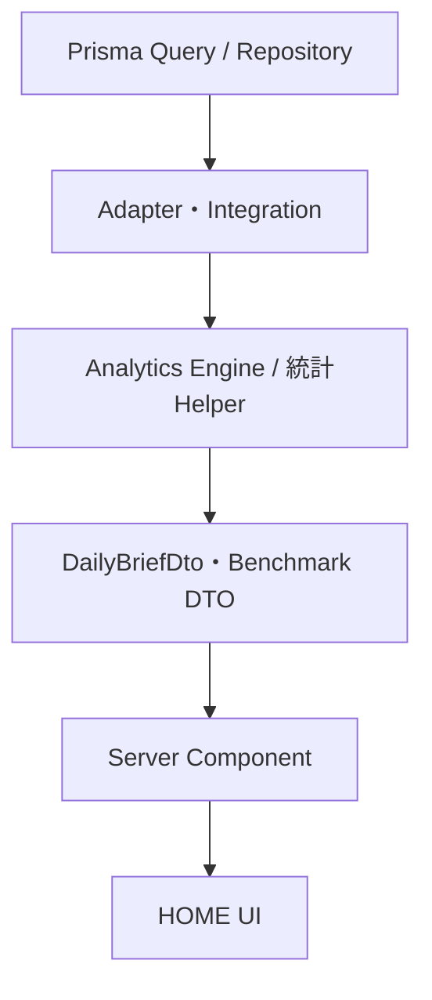

# HOME Architecture

**HOME v1.0 / 店舗運営・マーケティング司令塔**  
最終更新：2026-07-26

## 1. 目的

HOMEは、店長・エリア責任者・経営者が朝5分以内に、目標進捗、必要な運営水準、評価対象日の実績、比較、媒体活動、過去の参考水準、月間媒体見込み、来月の確認候補を把握し、次に開く詳細画面を判断する入口です。

HPlus Analyticsは単なる可視化ツールではなく、比較と根拠を伴う店舗経営OSです。

## 2. 主な利用者

- 店舗店長
- エリア責任者
- 経営者
- 運営状況を確認する管理者
- 分析に詳しくない利用者

分析担当者専用画面ではありません。内部キーや統計処理を知らなくても状態ラベルで判断できることを優先します。

## 3. データフロー

UIは集計、日付決定、意味判定、中央値・P25/P75、必要人数・必要成約数、必要水準との差の計算を行いません。UIはDTOを整形表示するだけです。

## 4. データソース

| 媒体 | HOMEで使う正式指標 |
|---|---|
| CTI | 売上、女子報酬、利益、予約数、成約数、接客数、出勤人数、出勤時間、本指名数、本指名率、写メ日記投稿数（補助） |
| Town | 店舗PV、店舗UU |
| Heaven | 女子ページアクセス、写メ日記投稿数 |

CTI写メ日記投稿数は取得可能な補助指標として保持しますが、前日主要KPIの主比較軸には含めません。Heaven写メ日記PVは存在しないため生成しません。媒体から予約・成約への直接経路は特定しません。

## 5. 店舗Scope

- CTI：春日部・越谷・野田
- Town：春日部・越谷
- Heaven：春日部のみ

全体表示のHeaven値は全店舗合算ではなく、春日部の正式値です。野田はCTI補助表示です。

## 6. 日付モデル

- **表示期間**：URLの`from`〜`to`
- **目標対象月**：表示期間の月初に対応する月目標
- **評価対象日**：確定済みデータから解決された対象日
- **実際の昨日**：カレンダー上の昨日。確定データがなければ代用しません
- **最新確定日**：DATA HEALTHが返す最新反映日
- **比較対象期間**：評価対象日より前の当月営業日・同曜日
- **Benchmark履歴期間**：評価対象日前の直近90確定日
- **過去完了月**：現在月を除く、確定済みデータの月次集計

未来日、未確定日、FAILED日、欠測売上日をBenchmarkや実績へ混入しません。

## 7. 主要DTO

実コード上の主要型は以下です。

- `DailyBriefDto`
- `BriefMetric`
- `GoalPaceDto`
- `DailyManagementCheckDto`
- `HomeComparisonRow`
- `GoalBenchmarksDto`
- `GoalBenchmarkMetricDto`
- `MonthlyMediaBenchmark`

仕様書上の`RequiredOperatingLevelDto`、`DailyMediaActivityDto`、`MonthlyMediaForecastDto`、`MonthlyMediaMetricDto`は独立した実型としては存在しません。必要な値は現在、`DailyManagementCheckDto`、`mediaActivity`、`MonthlyMediaBenchmark`に含まれます。

## 8. Query / Performance

CTI・Town・Heavenは並列取得し、必要列のみを選択します。日別・店舗別・指標別のN+1は行いません。Benchmarkは画面生成時に算出し、DBへ永続保存しません。生の日次データをClientへ渡しません。

## 9. Security

HOMEは`requireUser`で保護されたServer Componentです。HOMEから実績・Goal・ImportBatch・Aliasを更新しません。Goal更新は目標管理画面のみで行います。

## 10. Failure Handling

`VALUE`、`ZERO`、`MISSING`、`UNAVAILABLE`、`UNCOMPUTABLE`、`INSUFFICIENT_SAMPLE`を区別し、欠測を0へ補完しません。対象外Scopeは「対象外」と説明します。

## 11. Cast責務分離

HOMEは全体運営と目標判断の入口です。個別キャストの確認候補はHOMEに表示せず、Cast Analyticsへ集約します。互換性のためDaily Brief DTOの旧`castIssues`フィールドは保持しますが、HOME専用のCast取得Queryは実行せず空配列を返します。
