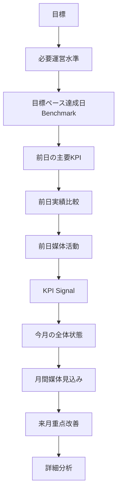

# HOME Design Principles

**HOME v1.0 / 店舗運営・マーケティング司令塔**  
最終更新：2026-07-26

## 1. Core Question

「現在の店舗運営は月目標に対してどこにいて、評価対象日はどう動き、過去の目標ペース達成日と何が違うか」を答える画面です。

## 2. Decision Flow

## 3. 現在の正式表示順

コード上の実際の順序は次のとおりです。

1. 画面説明・期間／店舗フィルタ
2. Daily Brief / DATA HEALTH
3. 月間目標達成ペース
4. 残り期間で必要なデイリー運営目安
5. 過去の達成日における運営実績
6. 過去の達成日における集客・活動実績
7. 前日の主要KPI（CTI中心）
8. 前日実績比較
9. 前日媒体活動
10. KPI Signal
11. 今月の全体状態
12. 店舗別要対応
13. 月間媒体見込み
14. 来月重点改善
15. 詳細分析への導線
16. 簡易トレンドグラフ

必要なデイリー運営目安では必要値を主役にし、前日値・同曜日平均は補助表示にします。Benchmarkでは達成日中央値と参考レンジを主役にし、当月平均との差を確認します。

## 4. セクションの役割

| セクション | 判断すること | 次に見る場所 |
|---|---|---|
| DATA HEALTH | 数値を信頼できるか | DATA HEALTH |
| 月間目標達成ペース | 目標に対する現在地 | 目標管理・店舗分析 |
| 必要運営水準 | 残り期間に必要な売上、出勤、成約、時間の目安 | 店舗分析 |
| 運営Benchmark | 達成日に観測された運営レンジと当月平均との差 | Trend / Store |
| 集客Benchmark | 達成日に観測された媒体レンジと当月平均との差 | Town / Heaven |
| 前日主要KPI | 評価対象日のCTI実績 | 前日実績比較 |
| 前日実績比較 | 当月・同曜日との差 | Trend |
| 前日媒体活動 | 前日の媒体活動の状態 | Town / Heaven |
| KPI Signal | 大きな変化の確認 | 該当詳細画面 |
| 今月の全体状態 | 月累計と補助実績 | Store Analytics |
| 月間媒体見込み | 現ペースの単純延長参考値 | Media Analytics |
| 来月重点改善 | 継続的に弱い指標 | CAST / Store / Diary |
| 要対応 | 店舗の確認候補 | 店舗分析 |
| グラフ | 日別の大きな流れ | Trend Analytics |

## 5. 情報の優先順位

1. 目標未達・DATA HEALTH異常
2. 必要運営水準
3. 評価対象日の実績
4. 過去の参考水準
5. 大きな変化
6. 月次累計
7. 来月改善候補
8. 詳細導線

必要水準カードの`gapFromRequired`は「現在の当月日平均 − 必要日次目安」です。Semantic Statusも当月平均と必要目安の比較で判定します。個別キャストの候補判定はCast Analyticsの責務です。

## 6. Semantic Color

- 緑：十分、達成ペース、強み
- 黄／橙：目安内、維持、注意
- 赤：不足、未達、要確認
- グレー：データ不足、対象外、算出不能、サンプル不足

色だけで意味を伝えず、必ず状態文字を併記します。

## 7. Compact Grid

実装CSSを正とします。

- 前日実績比較：639px以下1列、640〜919px2列、920px以上3列（Viewport fallbackとして1200px以上3列）
- 共通カードGrid：799px以下1列、800〜1199px2列、1200px以上3列
- Container Query：`home-dashboard`

## 8. Mobile / Accessibility

モバイルではカードを1列にし、重要値を先に表示します。横スクロールを発生させず、文字を極端に小さくしません。状態文字、見出し階層、aria-label、Focus visible、単位、中央値・参考レンジの説明を維持します。

## 9. No-AI / No-Causality

AI施策生成、媒体売上寄与、必要PV／UU、予約経路、機会損失、因果関係は表示しません。HOMEは事実・比較・参考水準を提示します。

## 10. 重複表示ポリシー

同じ指標でも質問が異なる再掲は許容します。

- 必要運営水準：何件必要か
- 運営Benchmark：達成日に何件だったか
- 前日主要KPI：昨日何件だったか
- 前日実績比較：平均と比べてどうか

同じ対象日・比較値・差異率・目的・導線を繰り返す場合は削除または統合候補です。同一指標が3か所以上に出る場合は役割をレビューします。
