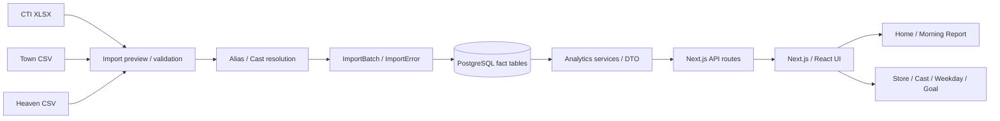

# HPlus Analytics Complete System Specification

**基準版:** `v1.0.1-production-ready`（repository tagで確認）
**文書版:** 2026-08-12  1.1（Documentation Final Sync）
**判定ラベル:** `CONFIRMED`（コード/DB/設定または実Productionで確認）、`INFERRED`（構造から合理的に判断）、`FUTURE`（計画）、`NOT VERIFIED`（まだ実確認できていない）

## 1. Document Information

この文書は、現行リポジトリを引き継ぐ開発会社が、目的・実装範囲・データ定義・運用上の制約を誤解しないための完全仕様書である。過去の設計資料と現行実装が異なる場合は、現行コードを正とし、差分を「既知の制約」に記載する。秘密情報、実IP、パスワードは記載しない。

## 2. Executive Summary

HPlus Analyticsは、CTI、デリヘルタウン（Town）、シティヘブン（Heaven）に分散する売上・出勤・成約・指名・顧客・媒体実績を統合し、店長が翌朝の事実、曜日の構造、キャストごとの改善確認箇所、月目標との差を短時間で確認する業務分析基盤である。

`v1.0.1-production-ready`では、認証、ImportBatch管理、日次fact、Home、Management、Store、Cast Diagnosis/Comparison/Action/Trend、曜日分析、目標管理、Production deploy/backup/restore/retentionの手順・スクリプトがリポジトリに存在する。Google Drive自動取込、外部監視、バックアップのオフサイト保管などは次Phaseである。

## 3. Business Background

従来は店舗・媒体ごとにCSV/XLSXと管理画面が分散し、同じキャスト名の表記揺れ、欠測と0の混同、店舗別の媒体対象差、月途中データを考慮した比較が難しかった。本システムは「数字を評価する」より「次に確認する事実を見つける」ことを優先する。

## 4. System Objectives

- 昨日何が起きたかを朝一番に把握する。
- 売上・成約・出勤・媒体流入の絶対値を同じ期間で比較する。
- 曜日・週・顧客構成を店舗営業施策の確認材料にする。
- キャストの結果、流入、写真指名、本指名・リピートをAvailability付きで確認する。
- 月目標に対する現在値、着地見込み、残り必要量を確認する。
- 分析結果を原因や因果として断定せず、面談・営業会議の確認候補として提示する。

## 5. Scope

### 対象

店舗分析、キャスト分析、曜日分析、Home/Morning Report、Management Dashboard、CTI/Town/Heavenの手動Import、データ状態、目標管理、運用バックアップ。

### 非対象または未実装

Google Drive自動Import、予約経路の因果特定、AI文章生成、施策自動実行、パスワード再設定、ログイン試行制限、外部監視基盤は`FUTURE`または`NOT IMPLEMENTED`である。

## 6. Users and Roles

| 利用者 | 権限 | 目的 |
|---|---|---|
| 店長/店舗責任者 | `VIEWER`または運用で付与した権限 | Home、Store、曜日、Castの閲覧 |
| 管理者 | `ADMIN` | 閲覧に加え、Import、Alias、Cast merge、開始日、目標、ユーザー管理 |
| 開発/保守 | 本番では個別付与 | deploy、migration、backup/restoreの運用 |

`CONFIRMED`: `User.role`は`ADMIN`/`VIEWER`、API更新系はADMIN再検証。実際の本番ユーザー運用・最小権限設定は`NOT VERIFIED`。

## 7. System Architecture



`CONFIRMED`: Docker appとPostgreSQLは専用network/volumeで構成。ProductionではNginxから`127.0.0.1:3001`へのreverse proxy、HTTPSアクセス、既存driver-managementとのHost/port分離を実確認済み。

## 8. Technology Stack

| 要素 | 現行値 |
|---|---|
| Runtime | Node.js engine `>=24.0.0`（Dockerfile node:24） |
| Web | Next.js `16.2.10`、React `19.2.4` |
| Language | TypeScript 5系 |
| Style/UI | Tailwind CSS 4、Radix Slot、lucide-react、class-variance-authority |
| DB | PostgreSQL `18-alpine` |
| ORM | Prisma `7.8.0`、`@prisma/adapter-pg` |
| Import | ExcelJS、CSV parser実装 |
| Auth | bcryptjs `3.0.3`、DB session |
| Test | Vitest `4.1.7`、Playwright `1.62.0`、axe-core |
| Runtime | Docker / Docker Compose |
| Proxy/HTTPS | Nginx、Let's Encrypt/Certbot、自動更新、HTTPSアクセスをProductionで確認 |

## 9. Functional Overview

1. 認証・権限
2. Home/Morning Report
3. Management Dashboard
4. Store Analytics
5. Weekday Analytics
6. Cast Analytics（一覧、詳細、Diagnosis、Comparison、Action、Trend、Media Funnel）
7. Import（CTI/Town/Heaven）
8. Data Health
9. Cast/Alias/Store Master
10. Monthly Goal
11. Production運用スクリプト

## 10. Screen / Route Inventory

| 画面 | URL | 主目的/状態 |
|---|---|---|
| Home | `/` | 前日事実、当月進捗、Data Health。`CONFIRMED` |
| Login | `/login` | 認証。`CONFIRMED` |
| Management | `/analytics/management` | 全体・店舗の経営KPI。`CONFIRMED` |
| Store | `/analytics/store`, `/analytics/stores` | 店舗日次/月次、比較、詳細。`CONFIRMED` |
| Weekday | `/analytics/time` | 曜日×週×顧客構成、営業会議。`CONFIRMED` |
| Cast list | `/analytics/cast`, `/analytics/casts` | キャスト一覧/概要。`CONFIRMED` |
| Cast detail | `/analytics/cast/[castId]` | Diagnosis、Comparison、Action、Trend Summary。`CONFIRMED` |
| Cast Trend | `/analytics/cast/[castId]/trend` | 月次推移・改善ストーリー。`CONFIRMED` |
| Cast discovery/overview | `/analytics/casts/discovery`, `/analytics/casts/overview` | 探索・一覧補助。`CONFIRMED` |
| Heaven analytics | `/analytics/heaven/store`, `/analytics/heaven/casts` | Heaven fact参照。`CONFIRMED` |
| Town analytics | `/analytics/town/stores`, `/analytics/town/casts`, `/analytics/town/urls`, `/analytics/town/landing` | Town粒度別参照。`CONFIRMED` |
| Diary | `/analytics/diary` | 既存route。通常導線は縮小方針、廃止は未実施。`PARTIAL` |
| Performance/Marketing/Navigator | `/analytics/performance`, `/analytics/marketing-lab`, `/analytics/navigator` | 補助分析・導線。詳細な本番利用実績は`NOT VERIFIED` |
| Data Health | `/data-health` | Import状態・最新確定日。`CONFIRMED` |
| Imports | `/imports`、`/imports/cti/*`、`/imports/town/*`、`/imports/heaven/*` | Preview/confirm/reparse/resolve。`CONFIRMED` |
| Masters | `/masters/stores`、`/masters/casts`、`/masters/aliases`、`/masters/casts/merge`、`/masters/casts/start-date-maintenance`、`/masters/users`、`/masters/import-sources` | 管理者マスタ。`CONFIRMED` |
| Goals | `/settings/goals` | 月次目標。`CONFIRMED` |
| Help/Design | `/help/analytics-guide`、`/help/metrics`、`/dev/analytics-design-system` | 説明・開発補助。`CONFIRMED` |

API route inventoryは27 route（analytics、health、imports）を実装ファイルで確認。全route詳細は27章に記載する。

## 11. HOME / Morning Report

目的は「朝一番に昨日の事実と当月着地を確認する」こと。`/api/analytics/daily-brief`が主DTOを返す。

### 表示内容（CONFIRMED）

- 評価日、最新確定日、対象期間、timezone `Asia/Tokyo`
- 店舗売上、女子報酬、成約/予約、出勤、稼働、日記等のKPI
- 前日、前週、前曜日、前月ToDate等の比較（利用可能な比較軸のみ）
- 月目標、達成率、単純ペースの着地予測、残り必要額、必要日次売上
- Town PV/UU、Heavenアクセス/日記等のmedia activity
- Data Health、pending/failed batch、open error、詳細導線
- Cast/Storeの確認候補とquick links

比較不能は`MISSING`/`UNCOMPUTABLE`等として表示し、欠測を0に変換しない。比較値は因果ではない。

## 12. Management Dashboard

全体・店舗の売上、成約、出勤、稼働、時給、指名、媒体をカード/グラフで表示する。`management-dashboard.ts`がvolume、efficiency、media、data health、comparisonを組み立てる。

- 主要結果: sales、contracts、reservations、attendance、working hours
- 効率: sales/hour、average unit price、regular nomination rate
- 媒体: Town PV/UU、Heaven access/diary（対象店のみ）
- 店舗構成: 店舗売上、share、work hours等
- 目標: goal、achievement、projection、remaining gap
- 店長向け思想: 事実→比較→確認先。色や比較は評価・因果を断定しない。

`CONFIRMED`: NODAは管理指標対象だがacquisition/Heaven適用範囲が異なる。`NOT VERIFIED`: 本番のSLO/p95。

## 13. Store Analytics

店舗・全体の結果を期間、店舗、日/週詳細で確認する。主な指標は店舗売上、女子報酬、成約、予約、出勤人数、稼働時間、平均単価、時給、指名、Town PV/UU、Heaven access/diaryである。

Availabilityと対象店舗を明示し、Heaven非対象店を0補完しない。日付は確定データの範囲に合わせ、詳細APIはday/week detailを提供する。

## 14. Weekday Analytics

`/analytics/time`と`/api/analytics/weekday`による営業会議向け分析である。

### 期間・scope

- 初期期間: 対象scopeの実績`min(business_date)`〜`max(business_date)`。
- 今日ではなく最新実データ日。手動変更後はmanual rangeを維持。
- `全体`、春日部、越谷。野田は曜日分析の正式scope外方針で、混入は監査対象。
- 「全期間」操作でauto rangeに戻せる。
- 月途中は`PARTIAL`相当の注記。

### 表示

- 曜日別実績一覧（月〜日、対象日数、売上、成約、新規、リピート、指名、出勤、稼働、Town、Heaven）
- 上段一覧の`weekdaySummaryMode`と下段Heatmapの`weekHeatmapMode`は独立。
- 各曜日詳細にも累計/1日平均切替、結果、顧客内訳、出勤・供給、媒体、第1〜5週内訳。
- 曜日比較は比較元/比較先、差額=左−右、差率=(左−右)/右。分母0/欠測は`—`。
- 営業サマリーは指標カードの全体平均、強い曜日、弱い曜日、曜日ランキング、曜日→第1〜5週ランキング。
- 営業メモは機械的な事実確認候補であり、Diagnosis/Actionではない。

### Heatmap

親セルは売上、内部行は売上・出勤・稼働・成約・新規・リピート・本指名・Town PV/UU・Heavenアクセス・写メ日記等を表示。

```text
heatValue(cell, metric) = cell.cumulative / cell.sampleDays
heatBaseline(metric) = mean(heatValue(c, metric)) for valid cells
deviation = (actual - baseline) / abs(baseline)
```

`sampleDays=0`、null、UNAVAILABLE、非有限値は評価対象外。0は有効実績。`safeLevel`は以下。

| deviation | level |
|---:|---|
| `< -0.20` | 1 非常に低い |
| `>= -0.20 && < -0.05` | 2 やや低い |
| `>= -0.05 && <= 0.05` | 3 平均付近 |
| `> 0.05 && < 0.20` | 4 やや高い |
| `>= 0.20` | 5 非常に高い |

表示モードは表示値だけを変える。累計モードは累計、1日平均モードは累計/対象日数を表示するが、色は常に1日平均`heatValue`と共通baselineで計算する。色は良否ではなく分布の方向である。

## 15. Cast Analytics

### 一覧/詳細

Cast一覧は期間・scope・メイン出勤等の条件に基づき、平均時給、女子報酬、成約、指名、Town/Heaven媒体、確認対象を表示。詳細は`/analytics/cast/[castId]`。

### Diagnosis / Comparison

- Diagnosis: `STABLE_HIGH_EFFICIENCY`、`LIMITED_BY_AVAILABILITY`、`LOW_PAGE_TRAFFIC`、`LOW_PROFILE_CONVERSION`、`LOW_REPEAT_CONVERSION`、`OTHER_REVIEW`、`INSUFFICIENT_DATA`等。
- AvailabilityとConfidenceを分離し、判定条件をDTOに保持。
- Comparison: 指標別Peer軸、本人除外、近似稼働時間、上位群中央値、Peer不足/フォールバック証跡。
- Peer選択とEngine判定をUIで再計算しない。

### Action / 面談支援

ActionはDiagnosis/Comparisonから確認方針を生成する。Review Targetは本指名・リピート、プロフィール、キャンセル、データ整合性等の日本語表示。原因・目標・因果を断定せず、面談で確認する。

### Trend

月次Trendは`COMPLETE`/`PARTIAL`、MISSING、UNAVAILABLE、現在ルールで再計算したDiagnosis/Action情報を保持。個別ページは改善ストーリー、主役指標、Direction、3か月平均との差、最高/最低、月次一覧・クリック詳細を表示する。

### Media Funnel

Heavenアクセス、写メ日記、マイガール増加、オキニトーク等を比較・参考表示する。現行仕様では正式Diagnosis/Actionの主判定ではなく、面談時の参考情報である。

## 16. Goal / Forecast

`MonthlyGoal`は`targetMonth`と`scopeKey`で一意。店舗売上目標（女子報酬前の店舗売上）とキャスト女子報酬目標を区別する設計を確認。

実装済み: 月目標入力、変更履歴、現時点実績、達成率、単純ペース予測、残り必要額、残日数、必要日次売上等。必要成約数・出勤・稼働への換算は利用可能な指標・設定に依存し、全ケースを保証しない（`PARTIAL`）。

## 17. Data Sources

| Source | 用途 | 粒度/形式 | 対象 |
|---|---|---|---|
| CTI | 売上、報酬、出勤、成約、予約、指名、顧客構成 | cast×store×businessDate、XLSX | 春日部/越谷/野田の3店舗。`CONFIRMED` |
| Town | 店舗/女子/URL/LPのPV、UU、TEL等 | 日次CSV | 春日部/越谷。野田はacquisition対象外 |
| Heaven | shop/castのアクセス、日記、マイガール等 | CSV、Snapshot/イベント種別 | 春日部のみ。越谷を0補完しない |
| ミテネ/Talk等 | Heaven metricKey内の媒体活動 | Heaven parserの対応範囲 | Availabilityに従う |

累計Snapshotから差分を作る指標はリセット/負差分を検知し、欠測を0にしない。日次イベント値はそのまま日次集計する。

## 18. CTI Import

- 入力: CTI女子別レポートXLSX。
- parserはシート名、ヘッダー行、既知列alias、未知列、値型を検出。
- 数値、円、全角、時刻、負値可否を列定義で検証。
- 店舗シート/名前から春日部・越谷・野田を判定。
- 除外行、未知列、値変換不能はpreview/ImportErrorとして保持。
- Alias解決状態: resolved、unmatched、ambiguous、warning/error。
- confirm後は`CtiCastDaily`へ自然キーupsert。
- `ImportBatch`はfileHash、対象期間、inserted/updated/skipped/pending/warning/errorを保持。
- 同日再Importはunique `[businessDate,storeId,castId]`で二重計上を防ぐ。
- reparse/resolve/confirmはADMIN API。

主要採用列: attendanceCount、attendanceMinutes、sameDayAbsenceCount、reservationCount、cancellationCount、serviceCount、regularNominationCount、photoNominationCount、freeCount、contractCount、newCount、repeatCount、salesAmount、castRewardAmount、diaryCountCti等（schema/codeの採用列を正とする）。

## 19. Town Import

4種: 店舗別、女子別、URL別、LP別。CSVのファイル名・内容・store sourceで春日部/越谷を判定し、PV、UU、平均PV、TEL tap、conversion等を日次factへ保存。URL/LPはnormalized URL、page type、cast解決状態を持つ。

Preview→resolution→confirm→upsertの順。未紐付けURL/IDの部分確定設計があり、`COMPLETED_WITH_WARNINGS`の後日再解析は資料上未実装のため、手動確認を必要とする。

## 20. Heaven Import

Heaven CSVはAPI/UIとも春日部storeIdのみ許可し、越谷指定は`HEAVEN_STORE_NOT_SUPPORTED`で400拒否。shop metricは`HeavenShopDaily`、cast metricは`HeavenCastDaily`へ保存する。

- `metricKey`/`resolutionKey`でアクセス、日記、MY_GIRL、ミテネ、Talk等を区別。
- 累計Snapshotはリセット境界・負差分を記録し、差分合計を暫定扱いにする場合がある。
- 未取得はMISSING、対象外はUNAVAILABLE、0はZERO。0補完禁止。
- fileHash重複、preview、alias resolution、confirm、reparse、cancel-duplicateを提供。

## 21. Cast / Alias Management

`Cast`は正規キャスト、`CastAlias`はmediaType/store/normalizedAlias/validFrom/validTo付き別名。common aliasはstoreId null、店舗aliasはstoreId付き。cast mergeはsource→targetとsnapshot/historyを保持し、merged castを分析から除外する。

- normalizedName/normalizedAliasで名前揺れを吸収。
- 同名は店舗・媒体・有効期間で分離。
- CastNameHistoryは変更前後名と実行者を保存。
- Start Date maintenanceはcast startedOn、alias validFrom、変更履歴を扱う。
- 退店日・再入店・期間重複は判定対象。
- `CastAlias` uniqueは`[mediaType, storeId, normalizedAlias, validFrom]`。同一Cast内重複は安全統合候補、別Castは競合として停止する。

## 22. Availability Model

| 状態 | 意味 |
|---|---|
| VALUE | 有効な値を取得 |
| ZERO | 取得でき、値が0 |
| MISSING | 対象のはずだがデータなし |
| UNAVAILABLE | 店舗/媒体対象外 |
| UNCOMPUTABLE | 母数0等で計算不能 |

分析、比較、Heatmap、Trend、UI formatterは状態を保持する。欠測を0へ補完すると「活動なし」と「未取得」が混ざるため禁止。

## 23. Import Idempotency

1. ファイル内容のSHA-256を計算。
2. 完了済み同一hashを重複検知。
3. ImportBatchとImportErrorを実行単位として記録。
4. fact tableの自然キーuniqueでupsert。
5. importBatchIdを保持し、再取込・障害調査・限定rollbackの根拠にする。

CTI/Town/Heavenでparserとresolutionは異なるが、hash、batch、自然キー、warning/errorの原則は共通。

## 24. Analytics Calculation Rules

- 売上、女子報酬、成約、出勤、稼働、指名はCTI factを基礎にする。
- 本指名率 = 本指名数 / 成約数。成約0はUNCOMPUTABLE。
- 写真指名率等の構成比は成約を分母とし、欠測は0にしない。
- 1日平均 = 累計 / 対象実日数。対象日数0は計算不能。
- 結果上位/Peer/ConfidenceはEngine/DTOを正としUI再計算しない。
- 月途中はPARTIAL、最新確定日を超える未来日は含めない。
- 集計期間・store・cast・merged除外条件を混在させない。

## 25. Heatmap Specification

14章の式と閾値を正式仕様とする。5段階色は低彩度の赤/neutral/緑で、意味は相対分布であり良否ではない。累計/平均の表示切替は色判定から分離する。詳細モーダル・正式値と概要短縮値も分離する。

## 26. Database Specification

全モデル（18テーブル）を以下に整理する。主キーはすべてUUID `id`。

| Prisma model / table | 目的・主要FK | unique/index |
|---|---|---|
| User / users | ユーザー、role | loginId unique |
| Session / sessions | token hash、期限、User FK | tokenHash unique、userId、expiresAt |
| Store / stores | 店舗マスタ | code unique |
| Cast / casts | キャスト、在籍、merge | normalizedName、primaryStore/status、mergedInto |
| CastNameHistory | 名前変更証跡 | cast/changedAt、user |
| CastMergeHistory | merge snapshot/証跡 | source/target/mergedAt |
| CastStartDateBulkChangeHistory | 開始日一括変更証跡 | changedAt/user |
| CastAlias / cast_aliases | 媒体別名、期間 | media/store/normalizedAlias/validFrom unique、reviewStatus/cast |
| MediaListing | 媒体掲載状態 | cast/store/media unique |
| ImportSource | 手動/将来Driveの取込元 | name unique、media/data/store |
| ImportError | 行・列・rawDataのエラー | run/source/batch/status/level/fileHash |
| ImportBatch | 実行、hash、期間、件数 | runId unique、fileHash/status、dataType/period |
| CtiCastDaily | CTI cast日次 | date/store/cast unique、cast/date、store/date、batch |
| TownStoreDaily | Town店舗日次 | date/store unique、store/date、batch |
| TownCastDaily | Town女子日次 | date/store/cast unique、cast/date、store/date、batch |
| TownUrlDaily | Town URL日次 | date/store/normalizedUrl unique、page/store/date/cast/date/batch |
| TownLandingDaily | Town LP日次 | date/store/normalizedUrl unique、page/store/date/cast/date/batch |
| HeavenShopDaily | Heavenショップ日次 | date/store/metric unique、store/date/metric/date/batch |
| HeavenCastDaily | Heaven女子日次 | date/store/metric/resolution unique、cast/date/store/date/batch/source name |
| ImprovementLog | 改善/確認ログ | cast/status/detected、store/type/status、observed period |
| MonthlyGoal | 店舗/キャスト月目標 | targetMonth/scopeKey unique、month/type/store |
| MonthlyGoalChangeHistory | 目標変更履歴 | goal/changedAt、user/changedAt |

`schema.prisma`には18 model（上記）とrelationsがある。移行は11 migration。開発PostgreSQL 18からProduction Docker PostgreSQL 18への実データ移行を完了し、public table 23、migrations 11を照合済み。移行時点の主要件数はstores 4、users 1、casts 199、cast_aliases 374、cti_cast_daily 8654、heaven_cast_daily 66430、heaven_shop_daily 1877、import_batches 721、import_errors 1523、import_sources 18、sessions 11、town_cast_daily 9584、town_landing_daily 17339、town_store_daily 136、town_url_daily 38608。これらは移行時点のスナップショットであり、現在値を固定する仕様ではない。

## 27. API Specification

### Analytics

| Method/URL | 用途/認証 |
|---|---|
| GET `/api/analytics/daily-brief` | Home DTO、ログイン |
| GET `/api/analytics/store` | Store集計、ログイン |
| GET `/api/analytics/store/day-detail` | Store日詳細、ログイン |
| GET `/api/analytics/store/week-detail` | Store週詳細、ログイン |
| GET `/api/analytics/time` | 旧/補助時間分析、ログイン |
| GET `/api/analytics/weekday` | 曜日DTO、ログイン |
| GET `/api/analytics/performance` | Performance、ログイン |
| GET `/api/analytics/trend` | Trend、ログイン |
| GET `/api/analytics/cast` | Cast一覧、ログイン |
| GET `/api/analytics/cast/diagnosis` | Diagnosis一覧、ログイン |
| GET `/api/analytics/cast/[castId]/detail` | Cast詳細、ログイン |
| GET `/api/analytics/cast/[castId]/trend` | Cast月次Trend、ログイン |
| GET `/api/analytics/diary` | Diary、ログイン |
| GET `/api/health` | DB接続status/database/timestamp。公開health |

### Import / Master

| Method/URL群 | 用途 |
|---|---|
| POST `/api/imports/cti/upload`, `/bulk/scan`, `/bulk/process` | CTI preview/bulk、ADMIN |
| POST `/api/imports/cti/[id]/confirm`, `/reparse`, `/resolve` | CTI確定/再解析/紐付け、ADMIN |
| POST `/api/imports/town/upload`, `/bulk/scan`, `/bulk/process`, `/bulk/link-candidates` | Town取込、ADMIN |
| POST `/api/imports/town/[id]/confirm`, `/reparse`, `/resolve` | Town確定/再解析/解決、ADMIN |
| POST `/api/imports/heaven/upload` | Heaven春日部固定preview、ADMIN |
| POST `/api/imports/heaven/[id]/confirm`, `/reparse`, `/alias`, `/bulk-alias`, `/cancel-duplicate` | Heaven管理、ADMIN |
| GET `/api/imports/[id]/file` | 原本download、ADMIN |

input/outputは各routeのzod/フォーム/DTOを正とし、エラーはHTTP statusと`error`/`code`を返す。API仕様書の詳細OpenAPIは未作成（`FUTURE`）。

## 28. Authentication / Authorization

- bcryptjsでpassword hash（seedはcost 12）。
- 32-byte random token、DBにはSHA-256 tokenHash。
- Cookie: httpOnly、production Secure、SameSite=Lax、path `/`、期限はデフォルト7日、1〜30日。
- `proxy`はsession cookieのない画面をloginへredirect。サーバー側`getCurrentUser`がDB・期限・isActiveを再確認。
- `requireUser`/`requireAdmin`と`requireAdminApi`を更新処理で使用。
- logoutはsession削除とcookie削除。
- rate limit、lockout、password reset、MFAは未実装。

## 29. Upload Security

- `MAX_UPLOAD_SIZE_MB`デフォルト20、1〜200で検証。
- XLSX: `.xlsx`、許可MIME、ZIP magic bytes。
- CSV: `.csv`、許可MIME、NUL byte拒否。
- filenameはbasename化・長さ制限、fileHashを計算。
- uploadはstorage volumeへ保存し、ImportBatchから参照。
- 更新APIはSame-Origin（Originがある場合）とADMINを検証。
- ウイルス/マクロスキャン、外部WAF/body-limit、暗号化・保持期限は`NOT VERIFIED/FUTURE`。

## 30. Frontend Architecture

Next App Routerのserver page + client presentation components。`src/components/analytics`に画面コンポーネント、`src/lib/analytics`にservice/engine/DTO/view-modelを分離する。概要は短縮、詳細は正式値。レスポンシブはPC優先、390pxで横overflowを避ける。ただし一覧/Heatmapは局所横scrollを許可する。

## 31. Backend Architecture

Routeはauth・入力検証・service呼び出し・DTO responseに限定する。Prisma adapter-pgでPostgreSQLへ接続し、analytics serviceがfactを読み集計。Engineは純粋関数/設定をテスト可能な形で分離。Importはparser→preview→resolution→persistenceの段階型。

## 32. Production Architecture

公開URL: `https://analytics.womansgroup.link`（XServer VPS）をProductionで確認済み。VPSの正確なOS/インスタンス詳細は`NOT VERIFIED`。

```text
Internet → Nginx/HTTPS → 127.0.0.1:3001 → HPlus Next.js app → Docker network → PostgreSQL
```

同一VPS上の既存driver-management（port 3000）とはapp、DB、volume、domainを分離し、NginxのHost分離で両方のHTTPSが動作することを確認済み。HPlus appは`127.0.0.1:3001`。UFWは外部incomingを制限し、SSH/HTTP/HTTPSの許可を確認済み。Production観測上のHost PostgreSQLは`127.0.0.1:5432`で外部公開されていない。Nginxの正確なserver block等はrepo外のため`NOT VERIFIED`。

## 33. Docker Specification

`docker-compose.production.yml`:

- db: postgres:18-alpine、container_name `hplus-analytics-db`、port非公開、healthcheck、restart unless-stopped。
- app: container_name `hplus-analytics-app`、`127.0.0.1:3001:3000`、`npm start`、`.env.production`、UPLOAD volume。
- network: `hplus_analytics_network`。
- volumes: `hplus_analytics_postgres`、`hplus_analytics_uploads`。
- app startupでmigration/seedを自動実行しない。deploy scriptがtemporary appでmigrationを明示実行。

ProductionでDocker app/dbの稼働と`/api/health`の正常応答を確認済み。実image digest、resource limit、log driverは`NOT VERIFIED`。

## 34. Nginx / HTTPS

ProductionではanalyticsサブドメインをNginxが受け、`127.0.0.1:3001`へproxyし、Let's Encrypt/Certbot HTTPSと自動更新が稼働していることを確認済み。driver-management（port 3000）とのHost分離と既存HTTPSも確認済み。HSTS、proxy headers、rate limit、実際のserver blockはrepo外のため`NOT VERIFIED`。開発会社へ本番設定のsecret/IPを渡さず、別の安全な運用資産として引き継ぐ。

## 35. Deployment

`scripts/deploy-production.sh`の順序:

1. `/opt/hplus-analytics`、`.env.production`、Compose存在確認。
2. `main` branch、tracked変更なし、開始commitを表示。
3. `git fetch origin`、`git pull --ff-only origin main`。
4. Compose config、app image build、DB起動/healthy確認。
5. temporary appで`npx prisma migrate deploy`。
6. app `up -d`、status確認。
7. `127.0.0.1:3001/api/health`をretryし、HTTP200、status ok、database connectedを必須化。

禁止: seed、DB reset、volume削除、compose down、git reset、force push、driver-management/nginx操作。自動rollbackはない。

実Productionでmain確認、未コミット変更確認、ff-only pull、image build、DB healthy、`migrate deploy`（pendingなし）、app再起動、health retry成功まで実行済み。ただし1回の成功は恒久的な可用性保証ではない。

## 36. Backup

`backup-production.sh`はDBコンテナIDをComposeから取得し、`pg_dump -Fc --no-owner --no-acl`をホスト一時ファイルへ出力する。サイズ（最小1024 bytes）、container内実ファイルを使う`pg_restore -l`、正式dump名でのSHA-256、`sha256sum -c`を全て通過した場合のみ正式renameする。途中失敗時は正式ファイルを残さない。

実Productionでcustom dump、サイズ確認、`pg_restore -l`、正式名SHA-256、`sha256sum -c`（`<dump>: OK`）まで成功済み。

## 37. Restore

`restore-production.sh`はdumpとchecksumを必須とし、SHA-256/pg_restore-list/DB healthを事前確認。対象DB、サイズ、timestamp、現在DBサイズを表示し、完全な`RESTORE`入力が必要。pre-restore backup後、appのみ停止、public schemaをdrop/create、`pg_restore --exit-on-error --no-owner --no-privileges`、table/`_prisma_migrations`/migration status、app再起動、healthを確認する。失敗時の自動rollbackは禁止で、pre-restore pathとstageを表示する。

開発DBからProductionへの手動custom-format移行（SHA-256転送、`pg_restore`）は成功済み。一方、同スクリプトによる破壊的な本番restore全手順は`NOT VERIFIED`。引数なし・dump不存在時に安全停止することのみ確認済み。

## 38. Retention / Cron

`backup-retention.sh`はdry-runがデフォルト、実削除は`--apply`。14日保持（`14*24*60=20160`分）、`find -mmin`で経過分を判定。対象はbackups直下のdump/checksumだけ、最新dumpと対応checksumを保護。

推奨cron（登録はVPSで別途）:

```cron
0 3 * * * cd /opt/hplus-analytics && ./scripts/backup-production.sh >> /var/log/hplus-backup.log 2>&1
0 4 * * * cd /opt/hplus-analytics && BACKUP_RETENTION_DAYS=14 ./scripts/backup-retention.sh --apply >> /var/log/hplus-backup-retention.log 2>&1
```

実Productionではroot crontabに上記03:00 backup、04:00 retention（`--apply`）を登録し、指定ログへ出力することを確認済み。14日dry-runは候補なし、1日dry-runは24時間超候補を表示し、`-mmin`（日数×24×60）判定と一致した。

## 39. Security / Firewall

ProductionでUFW enabled、default incoming deny、22/80/443（IPv4/IPv6）allow、SSH key再接続成功を確認済み。HPlus appは127.0.0.1:3001、PostgreSQLはlocalhost/Compose側で外部公開されていない。secret manager、ログ権限、backup encryptionは未整備/未確認。

## 40. Healthcheck / Monitoring

`GET /api/health`はDBへ`SELECT 1`し、成功時`{status:"ok", database:"connected", timestamp}`、失敗時HTTP503。外部監視、通知、metrics、SLO、log retentionは未接続（`FUTURE`）。
Productionの`https://analytics.womansgroup.link/api/health`でHTTP 200、`status=ok`、`database=connected`を確認済み。Production login画面と既存admin loginも成功済み。外部監視、通知、metrics、SLO、log retentionは未接続（`FUTURE`）。

## 41. Testing / QA

現時点の測定値（2026-08-12）: Vitest 74 files、346 passed、2 skipped。Playwrightはroutes/a11y/visualの24テストを列挙でき、QA credentialsを使うfixtureがある。CIでの認証済み実行・visual baseline承認・browser console 0件は`NOT VERIFIED`。lint、typecheck、build、git diff checkは運用gateに含む。

## 42. Non-functional Requirements

| 項目 | 現在 | 今後 |
|---|---|---|
| 可用性 | Docker restart/DB healthcheck | 外部監視、SLO、冗長化 |
| 性能 | DB index、範囲集計 | p95/同時実行benchmark、cache |
| Backup | custom dump、SHA、14日整理 | 暗号化、offsite、restore drill |
| 復旧 | 手動restore script | RTO/RPO測定、隔離restore自動化 |
| Security | session、ADMIN、upload validation | rate limit、MFA、WAF、secret rotation |
| 保守性 | service/engine/DTO、tests | OpenAPI、ADR、coverage gate |
| データ保持 | fact/importBatch/volume | 保持期限、PII削除ポリシー |
| UI | PC優先、390px配慮 | 実ユーザビリティ計測 |

## 43. UI / UX Principles

- まず事実、次に気になる点、最後に詳細。
- 絶対値を主役にし、相対値は補助。
- 緑/赤は平均との差の方向であり良否ではない。
- 0とMISSING/UNAVAILABLEを区別。
- 累計/平均の表示とHeatmap評価を分離。
- 概要は短縮、詳細は正式値。
- 店長が次に確認する場所を示すが、原因・因果・キャスト評価を断定しない。
- PC利用を主とし、モバイルは崩れない局所scrollを許容。

## 44. Business Glossary

| 用語 | 実装上の意味 |
|---|---|
| 店舗売上 | CTI/managementで店舗結果として扱う売上。目標定義は女子報酬前の店舗売上 |
| 女子報酬 | CTI `castRewardAmount`の集計 |
| 成約 | CTI `contractCount` |
| 新規 | CTI `newCount`。写真指名+フリー構成比とは別概念 |
| リピート | CTI `repeatCount` |
| 本指名 | `regularNominationCount` |
| 写真指名 | `photoNominationCount` |
| フリー | `freeCount` |
| 出勤延べ人数 | 日次castの出勤count集計。人日の延べ |
| 稼働時間 | attendance minutesを時間換算 |
| Town PV/UU | Town日次アクセス指標 |
| Heavenアクセス | Heaven metricKeyのcast/shop access |
| 写メ日記 | Heaven diary posts、またはCTI diaryCountCti。媒体を混同しない |
| Availability | VALUE/ZERO/MISSING/UNAVAILABLE/UNCOMPUTABLE |
| Heatmap baseline | 有効セルの日平均値の平均 |

## 45. Implementation Status Matrix

| 状態 | 項目 |
|---|---|
| IMPLEMENTED | 認証、Home、Management、Store、Weekday、Cast Diagnosis/Comparison/Action/Trend、手動CTI/Town/Heaven、Alias/Merge、Goals、Data Health、deploy/backup/restore/retention scripts |
| PARTIAL | 認証済みE2EのCI運用、Town partial再解析、破壊的なProduction restore script実行、監視、performance benchmark、Diary導線整理 |
| NOT IMPLEMENTED | Google Drive API自動取込、パスワードreset、login rate limit、MFA、外部通知、OpenAPI、AI施策自動実行 |
| FUTURE | Phase H Drive pipeline、scheduler/retry/quarantine、offsite backup、restore drill、RTO/RPO、運用メトリクス |

## 46. Known Limitations

1. Productionの正確なVPS OS、Nginx server block、resource limit、log driverはrepo外のため未確認。Nginx/HTTPS/UFW/Certbotの稼働自体はProductionで確認済み。
2. `restore-production.sh`の破壊的な本番restore全手順は未実行。引数なし・dump不存在時に安全停止する非破壊確認のみ実施。
3. E2E認証実行・visual snapshot・npm auditは監査時点で完全実行未確認。
4. DBログには管理履歴FK違反とcast name history長さ超過が過去に記録されている。該当操作は本番公開前に再監査。
5. Importは手動中心。自動取込・retry/quarantine・通知はない。
6. DB date rangeは媒体ごとに異なる。全期間比較でMISSING/UNAVAILABLEを0にしない。
7. 専用OpenAPI/ERD自動生成、SLO、PII保持期限は未整備。

## 47. Phase H / Google Drive Automation

これはv1.0.1の欠陥ではなく、次PhaseのFuture Requirementである。

```text
Google Drive → 新規file検知 → download → file判定
→ 既存parser/preview → ImportBatch → confirm → DB → Analytics
```

必要要素: Drive API、folder、service account/OAuth、file id、modifiedTime、etag、SHA-256、idempotency、scheduler、retry/backoff、quarantine、distributed lock、audit、manual retry、Data Health連携。初期は自動確定せずpreview/ADMIN confirmを推奨。

## 48. Future Roadmap

- Phase H: Google Drive pipeline。
- Production operations: external monitoring、backup encryption/offsite、restore drill、RTO/RPO。
- Security: login throttling、password reset、MFA、secret rotation。
- Analytics: 運用結果を見た上での曜日×週施策、媒体ファネルの正式Diagnosis採用判断。
- API/maintainability: OpenAPI、ADR、query benchmark、coverage/contract test。

過去資料で一度言及されたアイデアは、実装・承認されるまで確定要件ではない。

## 49. Development Handover Notes

- Importの自然キー/upsertとSHA-256 idempotencyを壊さない。
- Availability、Heaven春日部固定、野田scope、店舗目標の定義を維持。
- Heatmapは累計/平均表示と日平均評価を分離。
- Diagnosis/Comparison/ActionのDTOをUIで再計算しない。
- merged castを二重集計しない。
- schema変更前にbackup、migration review、restore drill。
- 本番deployはmain、tag、deploy script、healthの順。
- driver-managementとは別DB/network/volume/domain。絶対に横断操作しない。

## 50. Local Development Setup

1. Node 24系を用意。
2. `.env.example`を`.env`へコピーし、開発用値を設定（secretは共有しない）。
3. `docker compose up -d db`。
4. `npm ci`、`npx prisma migrate deploy`、`npm run db:seed`。
5. `npm run dev`、`http://localhost:3000`。
6. `npm test`、`npm run lint`、`npx tsc --noEmit --incremental false`、`npm run build`。

Production `.env.production`をローカルへコピーしない。fixture/QA用のDBを分離する。

## 51. Production Change Procedure

```text
feature branch → tests/lint/typecheck/build → review
→ main merge → Git tag/release → pre-change backup
→ deploy-production.sh → migration status/health
→ read-only smoke → Import再開
```

schema変更は別レビュー。migrationは`migrate deploy`のみ。本番で`migrate dev`、reset、seed、compose downをしない。

## 52. Git / Release Strategy

確認済みtag: `v0.2.0-cti-complete`、`v1.0-store-analytics`、`v1.0.0`、`v1.0.0-phase-f1`、`v1.0.1-production-ready`等。`v1.0.1-production-ready`は作成してGitHubへpush済みの正式マイルストーン。deploy対象commitの一致、ブランチ保護、署名tag、CI必須設定は別途`NOT VERIFIED`。

## 53. Operations Runbook Summary

- Health: `curl http://127.0.0.1:3001/api/health`。
- Deploy: `/opt/hplus-analytics/scripts/deploy-production.sh`。
- Backup: `/opt/hplus-analytics/scripts/backup-production.sh`。
- Restore: checksum付きdumpを指定し、完全な`RESTORE`確認。
- Retention: dry-run確認後`--apply`。
- Logs: `/var/log/hplus-backup.log`、`/var/log/hplus-backup-retention.log`例。
- DB migration: backup→review→temporary migration→status。
- 障害時: 自動rollbackせず、stage、commit、backup path、dump pathを記録し手動判断。

## 54. Appendix

### 調査根拠

`src/app`、`src/components`、`src/lib`、`src/generated`、`prisma/schema.prisma`、11 migrations、`scripts`、`tests`、`Dockerfile`、両Compose、`package.json`、`prisma.config.ts`、`README.md`、`AGENTS.md`、docs一式を再確認した。測定値は2026-08-12時点。ProductionではURL/HTTPS/Nginx proxy、既存admin login、health、deploy、backup、retention、UFW、SSH、cronを確認済み。開発→Production手動pg_restoreも成功済み。破壊的な`restore-production.sh`全手順、外部監視、Google Drive自動取込、認証済みE2E CIは`NOT VERIFIED`。

### Current verification

`npm test -- --run`: 346 passed / 2 skipped、lint/typecheck/build/git diff checkは成功。E2Eの認証済みCI実行、正確なVPS OS/server block/resource limit、外部Drive、npm auditネットワーク検証は`NOT VERIFIED`。
