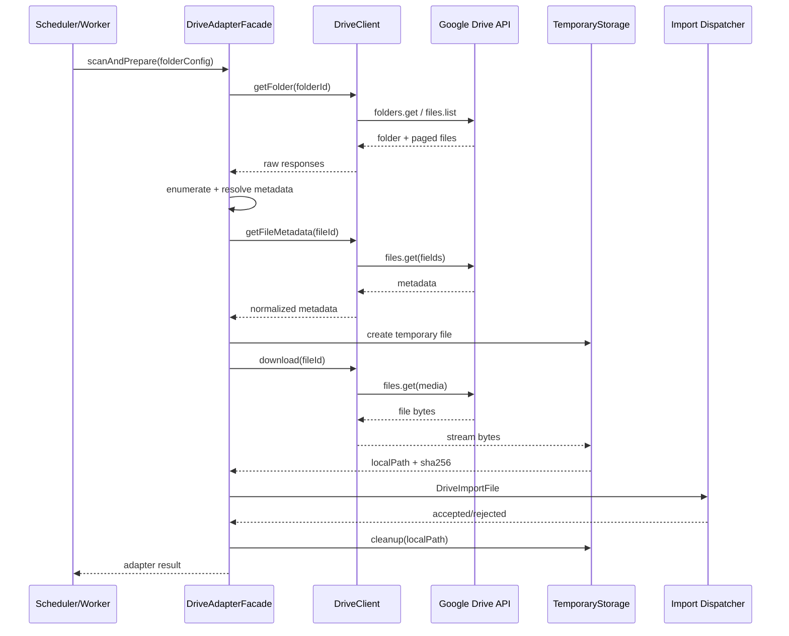
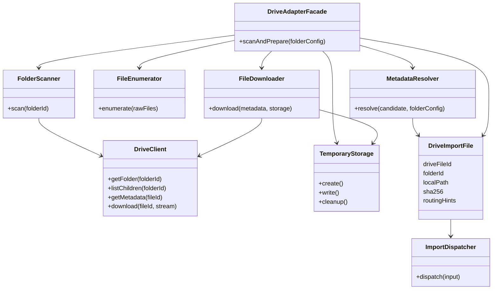

# Phase H Google Drive Adapter Specification

## 1. Document Information

- 対象Phase: H3
- 対象版: `v1.0.1-production-ready`
- 更新日: 2026-08-14
- 状態: **設計のみ（実装なし）**
- 変更対象: 本Markdownのみ
- 参照:
  - `docs/PHASE_H_GOOGLE_DRIVE_FOLDER_SPEC.md`
  - `docs/PHASE_H_IMPORT_AUTOMATION_ARCHITECTURE.md`
  - `docs/PHASE_H_GOOGLE_DRIVE_AUTHENTICATION_SPEC.md`

## 2. Purpose and Boundary

Google Drive AdapterはGoogle Drive APIからFolderとFileを読み取り、metadata付きの一時ローカルファイルをImport Dispatcherへ渡すためのAdapterである。

```text
Google Drive API
  ↓ Folder / File metadata
Drive Adapter
  ↓ temporary download
DriveImportFile
  ↓
Import Dispatcher（以降は別責務）
```

### Adapterが担当すること

- 認証済みGoogle Drive Clientの利用
- 登録済みFolder IDの取得
- 直下Fileの一覧列挙（v1ではSubFolderを再帰しない）
- File metadataの正規化
- binary download
- 一時ファイルの作成・削除
- download integrityの一次確認（size/SHA）
- Dispatcherが必要とするrouting hintの搬送

### Adapterが担当しないこと

- CSV/XLSXのParser、Header、Sheet、Required Column検証
- ImportSourceのDB検索・作成
- ImportBatch、ImportError、fact tableへの書込み
- Alias/Cast解決、Availability、Analytics
- retry、scheduler、quarantineの判断
- Drive Fileの削除、移動、rename、Folder作成、Upload

AdapterはImport Pipelineをimportしない。DBやAnalytics packageへの依存も持たない。

## 3. Adapter Architecture


### 3.1 Component list

1. `DriveClient`
2. `FolderScanner`
3. `FileEnumerator`
4. `MetadataResolver`
5. `FileDownloader`
6. `TemporaryStorage`
7. `DriveAdapterFacade`

## 4. Component Responsibilities

| Component | Responsibility | Input | Output | Errors | Dependencies |
|---|---|---|---|---|---|
| `DriveClient` | Google API呼出しだけを担当 | credentials, API request | authenticated API response | credential invalid, timeout, quota, 403/404 | Google Drive SDK/API |
| `FolderScanner` | Folder IDの存在・権限確認、直下File list取得 | `folderId` | raw Drive File list / folder metadata | folder not found, permission denied, API error | DriveClient |
| `FileEnumerator` | raw listから対象Fileを内部Modelへ変換、trash/Folder/unsupportedを区別 | raw File list | `DriveFileCandidate[]` | malformed response, duplicate ID | DriveClientの型のみ |
| `MetadataResolver` | File metadataを正規化し、Folder mapping hintを付与 | candidate, folder config | `DriveFileMetadata` | missing ID/name, invalid metadata | FileEnumerator output, config value |
| `FileDownloader` | 指定Fileのcontentを一時保存 | fileId, metadata, destination | temp file reference, byte count, digest | disappeared, interrupted, broken download | DriveClient, TemporaryStorage |
| `TemporaryStorage` | temp directory、atomic write、cleanup | logical key, stream/bytes | local path | disk full, permission, cleanup failure | local filesystem |
| `DriveAdapterFacade` | 上記の順序を orchestrationしDispatcher用Outputを返す | folder config, adapter options | `DriveImportFile` | component errorを分類して返す | 上記6 component |

各ComponentはDispatcher、ImportSource、Prismaを参照しない。`DriveAdapterFacade`の外側でDispatcherがrouting hintを既存設定へ照合する。

## 5. DriveClient

### 5.1 API boundary

DriveClientがGoogle SDKを隠蔽し、他ComponentへGoogle SDK型を漏らさない。

```text
listFolder(folderId)
getFileMetadata(fileId, fields)
downloadFile(fileId, writableStream)
```

必要fieldsは次の通り。

`id`, `name`, `mimeType`, `size`, `md5Checksum`, `modifiedTime`, `createdTime`, `parents`, `driveId`, `trashed`。

`driveId`は通常のMy Driveではnullになり得る。共有ドライブ対応はFutureであり、nullを異常としない。

### 5.2 Authentication

H2で設計したService Accountと`drive.readonly` scopeを利用する。Private key、Authorization header、credential JSONを戻り値・ログ・例外messageへ含めない。

## 6. FolderScanner

- 登録済みFolder IDを受け取る。
- Folder自体のmetadataとread permissionを確認する。
- `'<folderId>' in parents`相当の直下File一覧を取得する。
- v1ではSubFolderの再帰列挙をしない。正式な子Folderは別設定として個別に監視する。
- `trashed=true`は候補から除外する。
- Folder自体がFile listに混ざる場合はSubFolder候補として返すが、v1ではdownloadしない。
- paginationを最後まで処理する。
- Google APIのpage tokenを内部で扱い、呼出し元へ漏らさない。

Folder名は表示用、Folder IDは識別用。Folder名変更で設定を変更しない。

## 7. FileEnumerator

### 7.1 Internal candidate

```text
DriveFileCandidate
  driveFileId
  parentFolderId
  displayName
  mimeType
  sizeBytes
  md5Checksum
  modifiedTime
  createdTime
  parents
  driveId
  trashed
  kind: FILE | FOLDER | UNSUPPORTED
```

### 7.2 Candidate policy

- `trashed=true`: `IGNORED`候補。downloadしない。
- Folder: SubFolder対象外として`IGNORED`または監査候補。
- MIME/拡張子が設定に明らかに不一致: Dispatcherへ渡さず候補エラー。
- 同一Folder内の同一fileId重複: 1件へdeduplicate。
- nameは表示と補助validationに利用するが、媒体/店舗/metricの主要判定には使わない。

具体的なCTI/Town/HeavenのmappingはFolder Specificationにあり、Adapterはそれを解析せずrouting hintとして搬送する。

## 8. MetadataResolver

### 8.1 Required metadata

| Field | Meaning | Handling |
|---|---|---|
| `fileId` | Google Drive実体ID | 必須、idempotencyキー候補 |
| `name` | 表示名 | 必須、raw名を保持 |
| `mimeType` | Google MIME | 必須、形式検証へ渡す |
| `size` | bytes | download前後で確認 |
| `md5Checksum` | Drive側checksum | 取得可能なら保持、未提供を異常にしない |
| `modifiedTime` | 更新検知 | idempotency更新判定 |
| `createdTime` | 監査 | optional表示 |
| `parents` | 親Folder | requested Folderとの一致を確認 |
| `driveId` | Shared Drive識別 | My Driveではnull可、v1は利用しない |
| `trashed` | Trash状態 | trueは対象外 |

### 8.2 Routing hints

MetadataResolverは、Folder Configurationから以下をOutputへ付加できる。ただし正規化・DB解決はしない。

```text
mediaType
storeCode / storeId reference
importDataType
metricHint
folderConfigKey
```

Dispatcherが後で`ImportSource`と照合する。Adapter自身は値の妥当性やDB存在を判定しない。

## 9. FileDownloader

- Drive APIのmedia downloadをstreamで受ける。
- 全量をメモリに載せず、TemporaryStorageへ書き込む。
- fileId、期待size、期待md5が取得できる場合はdownload結果を検証する。
- 途中切断、レスポンス不完全、0 bytes、期待size不一致は失敗として返す。
- Download後のCSV/XLSX解析はしない。
- Downloaderはretryしない。例外をFacadeへ返し、retryはScheduler側が行う。

## 10. TemporaryStorage

### 10.1 Location comparison

| Location | 長所 | 注意 |
|---|---|---|
| `/tmp/hplus-drive/` | OSの一時領域、単純 | 再起動/cleanup、容量監視が必要 |
| `/app/data/tmp/` | Docker volume内で容量を管理しやすい | Upload領域との分離、権限設計が必要 |

ProductionではUpload原本領域と混在させず、専用tmp directory（例 `/app/data/tmp/drive/`）を推奨する。最終実パスはH9でDocker/volume構成と合わせて決定する。

### 10.2 File naming

候補比較：

- `driveFileId_originalFilename`: 可読だが特殊文字・長さ・衝突に注意
- UUID: 秘密漏洩を抑えやすいが追跡に別metadataが必要
- `sha256`: 内容同一性は表すが、download前は生成できない

推奨は、**安全なUUID一時名 + metadata内のdriveFileId/displayName**である。Path traversalを避け、元ファイル名をpathへ直接連結しない。

### 10.3 Lifecycle

1. Adapter起動時に前回残存の期限切れtempを掃除
2. Downloadはtemporary suffixへ書く
3. fsync/close後にatomic rename
4. DispatcherへlocalPathを渡す
5. Dispatcherが受領した後、Import結果にかかわらずcleanupを実行
6. 異常終了時は起動時掃除とTTLで回収

cleanup失敗はImport成功と混同せず、警告監査へ記録する。TemporaryStorageはDrive原本を削除しない。

## 11. DriveImportFile Output

### 11.1 Conceptual model

```text
DriveImportFile
  driveFileId
  folderId
  displayName
  localPath
  mimeType
  sizeBytes
  modifiedTime
  createdTime
  driveMd5Checksum
  sha256
  downloadedAt
  routingHints
    mediaType
    storeCode / storeReference
    importDataType
    metricHint
  sourceMetadata
```

`sha256`はAdapterがdownload後に生成する。Drive側md5が未提供でもnullを許容する。`DriveImportFile`はImportBatchを持たない。ImportBatch IDはDispatcher/Existing Pipelineが後から生成・関連付ける。

### 11.2 Dispatcher interface

概念インターフェース：

```text
dispatch(input: DriveImportFile): Promise<DispatchAccepted | DispatchRejected>
```

Adapterは`dispatch`の結果を受け取ってcleanup判断をするが、Import成功、DB保存件数、Alias解決状態の意味を解釈しない。Dispatcherは`DriveImportFile`を既存Manual Upload相当の入力へ変換する。

## 12. DriveAdapterFacade

FacadeはComponentを順序付ける薄いorchestratorである。

1. Folder ID検証
2. FolderScannerで直下候補列挙
3. FileEnumeratorでcandidate化
4. MetadataResolverで正規化
5. 対象FileごとにFileDownloaderへ渡す
6. TemporaryStorageへ書き込む
7. `DriveImportFile`をDispatcherへ返す/渡す
8. 取得済みtempのcleanupを保証する

FacadeはScheduler、Retry、DB、Import Pipelineの実装を持たない。SchedulerがFacadeの公開操作を呼び出す。

## 13. Error Handling

| Error | Adapter分類 | 方針 |
|---|---|---|
| Folder not found | `FOLDER_NOT_FOUND` | Folder設定不一致。File取得なし |
| Permission denied | `PERMISSION_DENIED` | shared Viewer権限を確認。自動Import停止 |
| API timeout | `API_TIMEOUT` | 例外を返す。RetryはScheduler |
| Rate limit | `API_RATE_LIMIT` | Retry-Afterを搬送可能。Adapterは再試行しない |
| Download interrupted | `DOWNLOAD_INTERRUPTED` | tempを破棄し、再試行候補 |
| File disappeared | `FILE_NOT_FOUND` | listとdownload間の消失。状態記録 |
| Broken download | `DOWNLOAD_INTEGRITY_FAILED` | size/md5/stream終端不一致。Dispatcherへ渡さない |
| Temporary disk full | `TEMP_DISK_FULL` | tempを掃除し、自動Import停止 |
| Credential invalid | `CREDENTIAL_INVALID` | auth failure。秘密値を返さない |
| Invalid metadata | `INVALID_METADATA` | candidateをquarantine相当として返す |

AdapterはError code、safe message、retryable flag、source identifiersのhash化情報を返す。Stack traceやcredentialは外部出力しない。

## 14. Retry Boundary

AdapterはRetry Policyを持たない。

- Adapter: API/Filesystem例外を分類して返す
- Scheduler/Worker: 最大試行、backoff、jitter、Retry-After、dead-letterを決定
- Dispatcher: validation拒否を成功再試行しない
- Existing Pipeline: ImportBatch/ImportErrorの既存状態を正とする

これにより、API retryとImport再実行が二重に発生することを防ぐ。

## 15. Logging

Adapterが記録するのは以下のみ。

- operation開始/終了
- Folder設定識別子（実Folder IDは平文を避ける）
- File数、fileIdのhash化識別子、サイズ
- Download開始/完了、所要時間
- エラーコード、retryable判定
- Temporary cleanup結果

記録禁止：Private key、credential JSON、Authorization header、ファイル内容、不要な個人情報、秘密設定値。

## 16. Performance

- 初期実装は逐次Downloadとする。
- 一度に全Fileをメモリへ保持しない。
- list paginationを処理する。
- 1 Fileごとにtemporaryを書き、Dispatcher受領後に削除する。
- 並列DownloadはFuture。導入時はAPI quota、disk容量、Import lock、DB負荷を同時評価する。
- 大量CSVではmetadata listとdownloadを分離し、未変更fileを再downloadしない。

## 17. Sequence Diagram



## 18. Class Diagram



## 19. Existing Pipeline Boundary

AdapterからDispatcherへ渡した後の処理は、H4以降の責務である。

```text
DriveImportFile
  → Import Dispatcher
  → ImportSource Resolution
  → existing createCtiPreview/createTownPreview/createHeavenPreview相当
  → Validation / Alias / Availability
  → ImportBatch / ImportError
  → existing fact upsert
```

Adapterは上記のService名やDBモデルを直接importしない。DispatcherがManual Uploadと同一のApplication Service境界へ接続する。

## 20. Security

- Service Account credentialはH2設計どおりread-only scope・read-only mount。
- Folder IDはConfiguration、Private keyはSecretとして分離する。
- Adapterのlog/exceptionから秘密値をredactする。
- ファイル名をpathへ直接連結せず、UUID一時名とpath traversal防止を使う。
- Downloadした一時ファイルを公開URLや`public/`へ置かない。
- AdapterはDrive Fileの削除、移動、rename、Uploadを呼ばない。

## 21. Open Questions

- Chunk Downloadを導入するファイルサイズ閾値
- 中断時のResume/Range requestをH3で実装するか、全量再取得にするか
- SHA-256を必須検証にするか、Drive `md5Checksum`を補助として扱うか
- Google側md5が取得できないFile種別の扱い
- Shared Drive対応（`driveId`、supportsAllDrives）は将来必要か
- Folder metadata/API responseのcache期間
- TemporaryStorageを`/tmp/hplus-drive/`と`/app/data/tmp/drive/`のどちらに置くか
- cleanup TTL、disk watermark、異常終了時のreaper方式
- 並列Download、queue、quota制御の導入時期
- Dispatcherが受領した後のcleanup acknowledgment契約
- fileId/Folder IDを監査ログでどの程度hash化するか

## 22. Future Adapters

OneDrive、Dropbox、S3、FTP、外部APIは、DriveClient固有実装を増やすのではなく、共通Adapter契約（list、metadata、download、temporary output、error classification）を実装する。Dispatcher以降と既存Import Pipelineは共通利用する。

## 23. Implementation Requirements

H3実装時の最低条件：

1. Google API依存がDriveClient/Adapter内部に限定されている。
2. `DriveImportFile`にImportBatchを含めない。
3. CSV/XLSXをAdapterで解析しない。
4. AdapterがDB/Prisma/Analyticsを参照しない。
5. Folder直下、pagination、trashed除外、metadata fieldsをテストする。
6. download中断、file消失、disk full、size/hash不一致をテストする。
7. temporary cleanupを成功・失敗・プロセス再起動で確認する。
8. retryはScheduler側に置き、Adapter単体テストで再試行を隠さない。
9. 未登録FolderとFUTURE mappingをDispatcherへ渡さない。
10. Production credential、実Folder ID、実ファイルをテストfixtureへ入れない。
