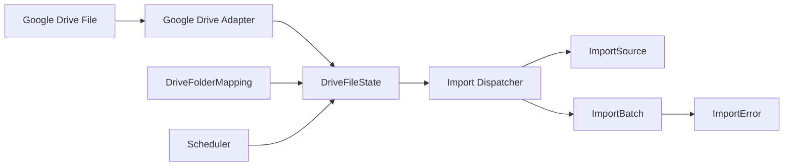
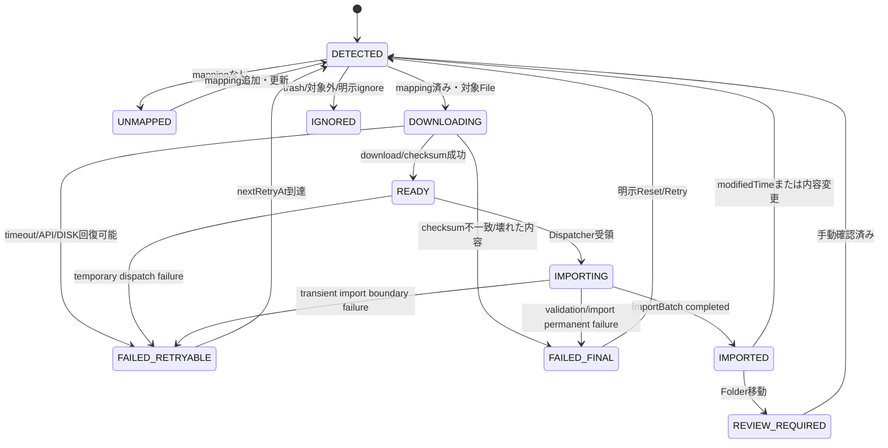
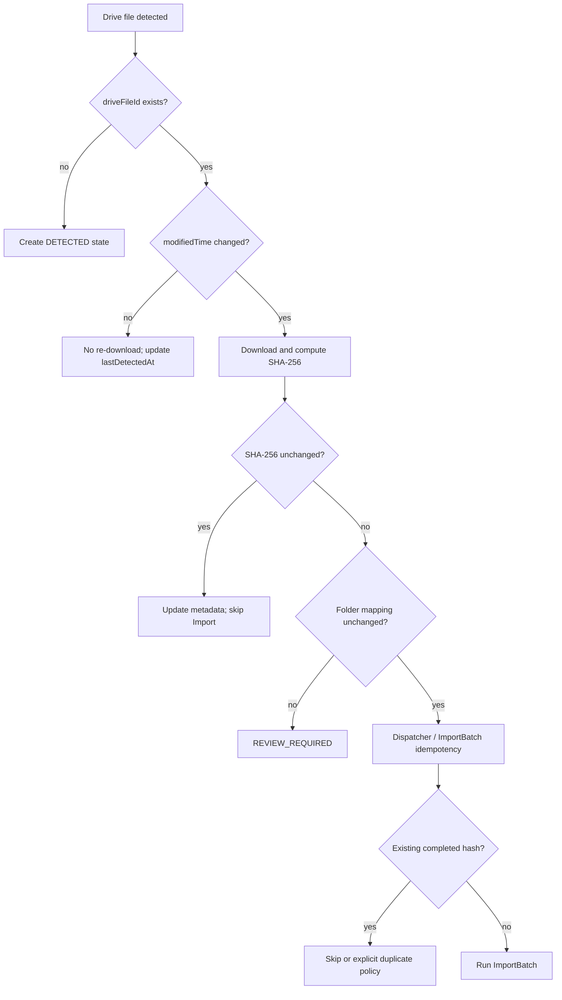
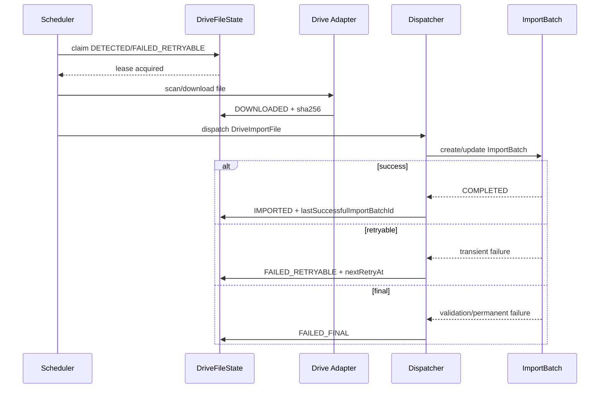

# Phase H Google Drive State Specification

## 1. Document Information

| Item | Value |
|---|---|
| Phase | H5 |
| Scope | Google Drive Adapter / Automation Layerの状態管理 |
| Status | H5 implementation |
| Database change | Additive H5 migration (not applied) |
| Related design | H1 Source Audit / Folder Spec / Automation Architecture / H2 Authentication / H3 Adapter |

本書は、Google Drive上のFileを検知してから既存Import Dispatcherへ渡すまでの状態管理を定義する。Import Pipeline自体の状態管理を再定義するものではない。

> **H5 implementation note:** 本書に残るH4時点の将来案は参考情報です。H5の実装上の正本は、`DriveFileState` Prisma model、`DriveFileStatus`の9状態（`DETECTED`、`DOWNLOADING`、`READY`、`IMPORTING`、`IMPORTED`、`FAILED_RETRYABLE`、`FAILED_FINAL`、`UNMAPPED`、`REVIEW_REQUIRED`）、`DriveFailureCategory`の12分類、およびH5 migrationです。`DOWNLOADED`/`IGNORED`、`importSourceId`/`storeId`等のDriveFileState重複保持は採用していません。

## 2. Responsibility Boundary

| Concept | Responsibility | H4 ownership |
|---|---|---|
| `ImportSource` | 媒体、店舗、Import種別、既存Manual/Drive経路の定義 | Existing Prisma model |
| `DriveFolderMapping` | Folder IDからImportSource、店舗、data type、metric hintを解決 | Future Drive configuration |
| `DriveFileState` | 個別Drive Fileの検知、内容識別、Download、Import参照状態 | H4 state model |
| `ImportBatch` | 実際に1回のImportを実行した履歴と保存結果 | Existing Import Pipeline |
| `ImportError` | Import内部の行・列・検証エラー | Existing Import Pipeline |

`DriveFileState`はImport処理を実行せず、CSV/XLSXを解析せず、DBの実績を書き換えない。H5では状態を保存するだけで、Dispatcherが既存のManual Upload相当のImport Serviceへ渡す処理はH6以降とする。

## 3. Existing Schema Alignment

現行の`ImportSource`は`kind`、`mediaType`、`dataType`、`storeId`、`folderPath`、`isActive`を持つ。Google Driveの実Folder IDやmetric hintは現行`folderPath`の意味を拡張して暗黙に保持せず、専用の`DriveFolderMapping`で管理する案を推奨する。

現行`ImportBatch`は`importSourceId`、`originalFilename`、`storedFilename`、`storagePath`、`fileHash`、`fileSizeBytes`、`dataType`、`importMode`、対象期間、`status`、件数、`metadata`を持ち、各媒体のDailyテーブルへリレーションする。`ImportError`は`runId`、`importSourceId`、`importBatchId`、ファイル情報、行・列、`errorCode`、message、statusを持つ。

従って、Drive固有の検知・再試行・Folder移動は`DriveFileState`で保持し、Import実績・内容エラーは`ImportBatch`/`ImportError`へ委譲する。H4では既存Prisma modelを変更しない。

## 4. State Architecture



状態の正本は`DriveFileState`、Importの正本は`ImportBatch`、Import内部エラーの正本は`ImportError`とする。`DriveFileState.lastImportBatchId`は参照用の最新ポインタであり、Import履歴そのものではない。

## 5. DriveFileState Model

### 5.1 Field evaluation

| Field | Decision | Purpose |
|---|---|---|
| `id` | Required | 内部主キー。Drive IDを主キーにしない |
| `driveFileId` | Required, unique | Google Drive Fileの安定した識別子 |
| `folderId` | Required | 最後に検知した親Folder |
| `fileName` | Required | 最新の表示名。監査・表示用で判定の主キーではない |
| `mimeType` | Required | Download/対応形式確認 |
| `sizeBytes` | Optional | Drive metadataとDownload後の整合確認 |
| `driveMd5Checksum` | Optional | Google提供checksum。Google Docs系など未提供を許容 |
| `sha256` | Optional | Download済み内容の正規checksum。未Download時null |
| `createdTime` | Required | Drive側作成日時 |
| `modifiedTime` | Required | Drive側更新検知の基準 |
| `firstDetectedAt` | Required | 初回検知時刻 |
| `lastDetectedAt` | Required | 最終検知時刻 |
| `lastDownloadedAt` | Optional | Download成功時刻 |
| `lastImportAttemptAt` | Optional | Dispatcherへ渡した試行時刻 |
| `lastImportedAt` | Optional | Import成功時刻 |
| `status` | Required | Adapter状態enum |
| `retryCount` | Required, default 0 | 現行File内容に対する連続Retry回数 |
| `nextRetryAt` | Optional | 再試行可能時刻 |
| `lastErrorCode` | Optional | 最後のAdapter/Schedulerエラー分類 |
| `lastErrorMessage` | Optional | 秘密情報を含まない要約 |
| `driveFolderMappingId` | Optional | Folder mapping FK。媒体・店舗・dataType・metricHintはMapping経由で解決 |
| `lastImportBatchId` | Optional | 直近のImport attemptが作ったBatch参照 |
| `lastSuccessfulImportBatchId` | Optional | 直近成功Batch参照 |
| `isTrashed` | Required, default false | Drive Trash/削除検知。物理削除しない |
| `lastSeenAt` | Optional | Drive一覧で最後に存在確認できた時刻 |
| `createdAt` | Required | State作成時刻 |
| `updatedAt` | Required | State更新時刻 |

`fileName`、`folderId`、mapping解決結果は最新値へ更新する。過去値が必要な場合は将来の監査イベントまたはAttempt履歴で補う。H4 v1では無制限の変更履歴を`DriveFileState`へ埋め込まない。

### 5.2 Recommended indexes

過剰な単独indexを避け、Schedulerと監査クエリに必要なものだけを推奨する。

1. unique `driveFileId`
2. `(status, nextRetryAt)` — READY/FAILED_RETRYABLEのScheduler抽出
3. `(folderId, status)` — Folder単位の監査・再走査
4. `(importSourceId, status)` — Import設定別の運用確認
5. `(modifiedTime, lastDetectedAt)` — stale detection / 変更監査

`sha256`、`driveMd5Checksum`の単独indexは、H4 v1では重複判定をImportBatchへ委譲するため必須としない。大量のchecksum検索が必要になった場合に追加評価する。

## 6. Status Enum

細かいImport内部状態を複製せず、Adapter/Schedulerが運用できる最小集合とする。

| Status | Meaning | Terminal | Retry |
|---|---|---:|---:|
| `DETECTED` | Drive一覧で存在を検知し、未処理または再評価対象 | No | Scheduler対象 |
| `DOWNLOADING` | 一時領域へDownload中 | No | timeout/lock回復後 |
| `READY` | Downloadとchecksum検証に成功 | No | Dispatcherへ送る |
| `IMPORTING` | Dispatcherへ渡し、ImportBatch実行中 | No | Batch結果に従う |
| `IMPORTED` | 最新内容がImport成功済み | Yes until change | modifiedTime changeでDETECTED |
| `FAILED_RETRYABLE` | 一時的失敗。再試行可能 | No | nextRetryAt以降 |
| `FAILED_FINAL` | 恒久失敗または最大Retry超過 | Yes | 手動再処理のみ |
| `UNMAPPED` | Folder mappingが未解決/無効 | No | mapping変更時再評価 |
| `REVIEW_REQUIRED` | Folder移動・設定変更など自動継続が危険 | No | 手動確認後 |

`DOWNLOADING`や`IMPORTING`を長時間残さないため、Schedulerはlease/timeoutを検知して`FAILED_RETRYABLE`へ戻す。`status`だけを排他lockとして使用しない。

## 7. State Transition



`ImportBatch`が`FAILED`になった場合の最終状態はエラー分類で決める。ImportBatchの状態をDrive側statusへ一対一でコピーしない。

## 8. Folder Mapping and Folder Change

### 8.1 Mapping model

H1の「1 Folder = 1 Import Configuration」をDB設定として明示する。既存`ImportSource`は媒体・種別の定義を持ち、Folder IDの一意性とDrive固有のfuture flagは`DriveFolderMapping`へ分離する。

| Field | Purpose |
|---|---|
| `id` | Internal ID |
| `driveFolderId` | Google Drive Folder ID、unique候補 |
| `displayName` | 管理画面表示用 |
| `importSourceId` | Existing ImportSource参照 |
| `storeId` | 店舗固定。CTI複数店舗の場合null可 |
| `importDataType` | ImportDataType |
| `metricHint` | Heaven等の指標ヒント |
| `priority` | 将来の複数候補解決。通常1 |
| `isActive` | Scheduler対象フラグ |
| `isFuture` | 予約済み、Dispatcherへ流さない |
| `createdAt`, `updatedAt` | 監査 |

`importSourceId`に既存の`folderPath`文字列をコピーして二重管理しない。Mappingは`driveFolderId`を正本とし、ImportSourceは既存のsource定義を正本とする。

### 8.2 File moved to another Folder

同じ`driveFileId`で`folderId`が変わった場合、名前変更とは異なりImport設定が変わる可能性がある。

1. 新FolderのMappingを解決する。
2. 旧Mappingと新Mappingの`importSourceId/storeId/dataType/metricHint`を比較する。
3. mappingが同一なら`folderId`と監査情報を更新し、`DETECTED`へ戻して内容変更判定。
4. mappingが異なる、または店舗が変わる場合は自動Importせず`REVIEW_REQUIRED`。
5. 新Folderが未登録なら`UNMAPPED`。旧Folderの成功履歴は保持する。

安全側として、Town春日部からTown越谷へ移動したFileを自動的に別店舗実績へ再Importしない。

### 8.3 Rename and deletion

同じ`driveFileId`のrenameは同一Fileとして扱い、`fileName`だけ最新化する。ファイル名を主キーや重複判定の根拠にしない。

Drive一覧から消えた、またはTrashになった場合もStateを物理削除しない。`isTrashed=true`、`lastSeenAt`を更新し、最後のFolder、checksum、ImportBatch参照を監査用に残す。復活したFileは`DETECTED`へ戻して再評価する。

## 9. Duplicate and Idempotency Policy

| Signal | Responsibility | Decision |
|---|---|---|
| `driveFileId` | Drive State | 同じDrive実体の追跡。rename/Folder移動を吸収 |
| `modifiedTime` | Drive State | 前回検知との差分。変更時に再評価 |
| `driveMd5Checksum` | Adapter hint | Drive側checksum。未提供を許容、単独で成功判定しない |
| `sha256` | Adapter/State | 実Download内容の同一性。checksum検証と監査 |
| ImportBatch `fileHash` | Import Pipeline | 既存の完了Batch重複/idempotency。媒体・店舗・dataType条件と併用 |

判定規則：

- 同一`driveFileId` + `modifiedTime` unchanged: 原則Download/再Import不要。
- 同一`driveFileId` + `modifiedTime` changed: Downloadして再評価。
- `modifiedTime` changedでもSHA-256が同一: 内容再Importは不要候補。検知時刻とmetadataだけ更新し、mapping変更があればReviewする。
- 別`driveFileId`でもSHA-256が同じ: DriveFileStateは別Fileとして保持し、ImportBatchの既存fileHash重複判定へ渡す。Drive Stateが別Fileを勝手に統合しない。
- `ImportBatch.fileHash`の重複は既存Import Serviceの責務であり、Drive Stateの`driveFileId` uniqueと二重に扱わない。

同一内容でも異なる店舗・dataTypeで安全性が変わるため、最終重複判定には既存source/store/dataType/対象期間の条件を使う。



## 10. ImportBatch Relationship

### 10.1 Minimal H5 v1

H5 v1では`DriveFileState`に次の2つのnullable参照を持たせる最小構成を採用する。

- `lastImportBatchId`: 最新のDispatcher試行が生成/関連付けたBatch
- `lastSuccessfulImportBatchId`: 最新成功Batch

`ImportBatch`側に必須のDrive FKを追加せず、Drive provenanceはStateの参照とBatch metadata（将来の`driveFileId`, `folderId`, `modifiedTime`, `sha256`）で表現する。既存Manual Upload Batchを壊さないためである。

### 10.2 Attempt model comparison

| Option | Advantages | Risks | Recommendation |
|---|---|---|---|
| State pointers only | Schema最小、既存Batch互換、H4実装が小さい | 過去Retryの詳細がStateから直接見えない | H4 v1採用 |
| `DriveImportAttempt` | 全試行、開始/終了、error、Batchの対応を明示できる | Model増加、ImportBatchと重複、Retention/locking設計が必要 | Future |
| ImportBatch metadata only | 既存Batchを再利用 | Drive検知失敗やDownload失敗を記録しにくい | State pointersの補助 |

現行`ImportBatch`はファイルhash、status、件数、failureMessageを持つため、Importが開始された後の監査は十分可能である。一方、Download前の失敗はStateで記録する。従ってH4では`DriveImportAttempt`を新設しない。

## 11. Retry Policy

Retry対象は一時的エラーだけとし、同じFile内容に対するRetry回数を`retryCount`で管理する。backoffの最終値はH6 Schedulerで確定する設計案とする。

| Attempt | Delay | Typical cause |
|---:|---:|---|
| 1 | 5分 | transient API, timeout |
| 2 | 15分 | rate limit, network |
| 3 | 1時間 | temporary Drive/API |
| 4 | 6時間 | repeated transient |
| 5以降 | final候補 | 最大回数超過 |

`FAILED_RETRYABLE`は`nextRetryAt`を必須とし、Schedulerが時刻到達後に`DETECTED`へ戻す。`FAILED_FINAL`は自動Retryしない。手動Retryは後述の安全条件を満たす明示操作とする。

## 12. Failure Categories

| Category | Examples | Classification | State |
|---|---|---|---|
| `AUTH` | credential invalid/expired | Final until credential repair | `FAILED_FINAL` |
| `PERMISSION` | Folder/File 403 | Final or review | `FAILED_FINAL` / `REVIEW_REQUIRED` |
| `FOLDER_NOT_FOUND` | mapping Folder 404 | Final mapping issue | `UNMAPPED` or `FAILED_FINAL` |
| `FILE_NOT_FOUND` | File deleted during scan/download | Terminal observation | `IGNORED` with `isTrashed` |
| `DOWNLOAD` | timeout, interrupted stream | Retryable | `FAILED_RETRYABLE` |
| `CHECKSUM` | size/hash mismatch | Final until source changes | `FAILED_FINAL` |
| `VALIDATION` | unsupported format, broken CSV/XLSX | Final | `FAILED_FINAL` |
| `IMPORT` | existing Import validation/business error | Usually final, per Batch | `FAILED_FINAL` |
| `TRANSIENT_API` | 5xx, connection reset | Retryable | `FAILED_RETRYABLE` |
| `RATE_LIMIT` | 429/quota | Retryable | `FAILED_RETRYABLE` |
| `DISK` | temp storage full/permission | Retryable after operator action | `FAILED_RETRYABLE` |
| `UNKNOWN` | uncategorized exception | Retry once, then final | `FAILED_RETRYABLE` / `FAILED_FINAL` |

Error messages must be sanitized. OAuth token、refresh token、Authorization header、download URL query secretを保存しない。

## 13. Lock and Concurrency

`DriveFileState.status`だけをlockとして使うと、同時Schedulerが同じFileを処理できる。次のいずれかを採用する。

1. DB transaction内のrow lock (`SELECT ... FOR UPDATE SKIP LOCKED`)で候補をclaimする。
2. state rowにlease owner/expiryを追加してclaimする。
3. File IDをキーにしたPostgreSQL advisory lockを使う。

H4 v1の推奨は、Schedulerが短いtransactionでrowをclaimし、`DOWNLOADING`/`IMPORTING`のlease timeoutを持つ方式である。DB schemaを変更できない設計段階では、advisory lockを実装候補として残す。処理中の重複Importをstatus比較だけで防止しない。

## 14. Scheduler Query

通常のSchedulerは以下を対象にする。

```text
status = DETECTED
  OR (status = FAILED_RETRYABLE AND nextRetryAt <= now)
```

追加条件：

- `isTrashed = false`
- `UNMAPPED`、`REVIEW_REQUIRED`、`FAILED_FINAL`、`IGNORED`は自動対象外
- lease期限切れの`DOWNLOADING`/`IMPORTING`は回復処理で`FAILED_RETRYABLE`へ戻す
- mappingが`isActive=true`かつ`isFuture=false`
- 同一Fileのclaimに成功したものだけAdapterへ渡す

## 15. Retention and Manual Reprocess

### 15.1 Retention

`DriveFileState`は検知・Folder移動・Import参照の監査証跡であるため、原則長期保持する。物理削除はFutureとし、削除する場合も`ImportBatch`や`ImportError`の参照を壊さないsoft-delete/アーカイブを先に設計する。

`ImportBatch`のRetentionとDrive StateのRetentionは別に決める。Batchを整理しても、Stateの`lastSuccessfulImportBatchId`が参照不能になった場合の表示を定義してから削除する。

### 15.2 Manual reprocess

管理画面/CLIの明示操作でのみ、`FAILED_FINAL`または`REVIEW_REQUIRED`を`DETECTED`へ戻す。操作にはユーザー、理由、対象driveFileId、現在checksum、mapping確認を必須とする。

同じ内容を無制限に再処理しないため、次を要求する。

- `retryCount`をリセットするのは内容または設定が変わった場合のみ。
- 既存の完了Batchが同じhash・source・dataType・対象期間なら、明示forceなしで再Importしない。
- 手動Reset後も同じ失敗が続けば再び`FAILED_FINAL`にする。

## 16. Audit Requirements

最低限、以下をStateまたは既存Batch参照から確認できるようにする。

- `driveFileId`, `folderId`, 最新`fileName`
- mapping解決結果（ImportSource、store、data type、metric hint）
- detected / downloaded / imported timestamps
- statusの現在値、retryCount、nextRetryAt
- last error category/code/message
- last/last successful ImportBatch ID
- modifiedTime、Drive md5、SHA-256、size
- isTrashed、lastSeenAt

監査ログに秘密情報を記録しない。File ID自体は運用上必要だが、外部公開ログへ出す場合はhash化する。

## 17. Prisma Design Proposal (Future Only)

以下は将来のschema案であり、H4では追加しない。

```prisma
enum DriveFileStateStatus {
  DETECTED
  DOWNLOADING
  DOWNLOADED
  IMPORTING
  IMPORTED
  FAILED_RETRYABLE
  FAILED_FINAL
  UNMAPPED
  IGNORED
  REVIEW_REQUIRED
}

model DriveFileState {
  id                         String   @id @default(uuid()) @db.Uuid
  driveFileId                String   @unique @map("drive_file_id") @db.VarChar(255)
  folderId                   String   @map("folder_id") @db.VarChar(255)
  fileName                   String   @map("file_name") @db.VarChar(255)
  mimeType                   String   @map("mime_type") @db.VarChar(255)
  sizeBytes                  BigInt?  @map("size_bytes")
  driveMd5Checksum           String?  @map("drive_md5_checksum") @db.Char(32)
  sha256                     String?  @db.Char(64)
  createdTime                DateTime @map("drive_created_time") @db.Timestamptz(3)
  modifiedTime               DateTime @map("drive_modified_time") @db.Timestamptz(3)
  firstDetectedAt            DateTime @map("first_detected_at") @db.Timestamptz(3)
  lastDetectedAt             DateTime @map("last_detected_at") @db.Timestamptz(3)
  lastDownloadedAt           DateTime? @map("last_downloaded_at") @db.Timestamptz(3)
  lastImportAttemptAt        DateTime? @map("last_import_attempt_at") @db.Timestamptz(3)
  lastImportedAt             DateTime? @map("last_imported_at") @db.Timestamptz(3)
  status                     DriveFileStateStatus
  retryCount                 Int      @default(0) @map("retry_count")
  nextRetryAt                DateTime? @map("next_retry_at") @db.Timestamptz(3)
  lastErrorCode              String?  @map("last_error_code") @db.VarChar(100)
  lastErrorMessage           String?  @map("last_error_message") @db.Text
  importSourceId             String?  @map("import_source_id") @db.Uuid
  storeId                    String?  @map("store_id") @db.Uuid
  importDataType             ImportDataType? @map("import_data_type")
  metricHint                 String?  @map("metric_hint") @db.VarChar(100)
  lastImportBatchId          String?  @map("last_import_batch_id") @db.Uuid
  lastSuccessfulImportBatchId String? @map("last_successful_import_batch_id") @db.Uuid
  isTrashed                  Boolean  @default(false) @map("is_trashed")
  lastSeenAt                 DateTime? @map("last_seen_at") @db.Timestamptz(3)
  createdAt                  DateTime @default(now()) @map("created_at") @db.Timestamptz(3)
  updatedAt                  DateTime @updatedAt @map("updated_at") @db.Timestamptz(3)

  @@index([status, nextRetryAt])
  @@index([folderId, status])
  @@index([importSourceId, status])
  @@index([modifiedTime, lastDetectedAt])
  @@map("drive_file_states")
}

model DriveFolderMapping {
  id             String   @id @default(uuid()) @db.Uuid
  driveFolderId  String   @unique @map("drive_folder_id") @db.VarChar(255)
  displayName    String   @map("display_name") @db.VarChar(255)
  importSourceId String   @map("import_source_id") @db.Uuid
  storeId        String?  @map("store_id") @db.Uuid
  importDataType ImportDataType @map("import_data_type")
  metricHint     String?  @map("metric_hint") @db.VarChar(100)
  priority       Int      @default(1)
  isActive       Boolean  @default(true) @map("is_active")
  isFuture       Boolean  @default(false) @map("is_future")
  createdAt      DateTime @default(now()) @map("created_at") @db.Timestamptz(3)
  updatedAt      DateTime @updatedAt @map("updated_at") @db.Timestamptz(3)

  @@index([importSourceId, isActive, isFuture])
  @@map("drive_folder_mappings")
}
```

`DriveImportAttempt`はH4 v1では非採用とする。将来、Download失敗を含む全試行の監査や複数Dispatcher実行を一級データとして検索する要件が出た場合に追加する。

## 18. DriveImportAttempt Evaluation

| Requirement | State + ImportBatchで足りるか | Decision |
|---|---:|---|
| 最新成功Batchの確認 | Yes (`lastSuccessfulImportBatchId`) | No new model |
| Import開始後の失敗 | Yes (`ImportBatch.status`, `ImportError`) | No new model |
| Download前/API失敗 | Yes (`DriveFileState.lastError*`) | No new model |
| 全Retryの時系列一覧 | No | Future Attempt model |
| 1 Fileから複数Batchの詳細対応 | Batchのmetadataで暫定可能 | H4はstate pointer |

Attemptを追加する場合は、`driveFileStateId`、`attemptNo`、`startedAt`、`finishedAt`、status、`importBatchId`、error code/message、content SHA-256を持たせ、`ImportBatch`と同じ意味の件数・実績状態を重複保持しない。

## 19. Failure and Recovery Flow



Failure時に自動的にDrive Fileを別Folderへ移動したり、Drive上の原本を削除したりしない。Quarantineは論理状態であり、`FAILED_FINAL`/`REVIEW_REQUIRED`で表現する。

## 20. Implementation Recommendation for Phase H v1

最小限の安全な実装セットは次のとおり。

### Model

1. `DriveFileState`
2. `DriveFolderMapping`
3. 既存`ImportSource`
4. 既存`ImportBatch` / `ImportError`

`DriveImportAttempt`は採用しない。

### Required fields

`driveFileId`、`folderId`、`fileName`、`mimeType`、`sizeBytes`、`driveMd5Checksum`、`sha256`、`createdTime`、`modifiedTime`、detected/downloaded/import timestamps、`status`、`retryCount`、`nextRetryAt`、last error、mapping解決項目、last Batch pointers、`isTrashed`、`lastSeenAt`、created/updated timestamps。

### Status

`DETECTED`、`DOWNLOADING`、`DOWNLOADED`、`IMPORTING`、`IMPORTED`、`FAILED_RETRYABLE`、`FAILED_FINAL`、`UNMAPPED`、`IGNORED`、`REVIEW_REQUIRED`の10状態。

### Index

1. unique `driveFileId`
2. `(status, nextRetryAt)`
3. `(folderId, status)`
4. `(importSourceId, status)`
5. `(modifiedTime, lastDetectedAt)`

実装時も、DriveFileStateがImportロジックを持たず、Dispatcherだけが既存Import Serviceを呼ぶ境界を維持する。

## 21. Open Questions

以下はH4で決めきらず、Scheduler/運用設計で確定する。

- `DriveImportAttempt`を将来採用する境界（監査要件、保持期間、検索量）
- Retry最大回数とbackoffの正式値
- FAILED_FINALのManual Retry/Reset/Ignore UIまたはCLI
- State retention期間とsoft delete/アーカイブ方式
- Google Drive Changes APIを使うか、定期Folder scanだけにするか
- Folder mapping変更の承認者とREVIEW_REQUIRED解除手順
- Shared Drive、`driveId`、`supportsAllDrives`の対応時期
- SHA-256必須検証とDrive md5未提供Fileの扱い
- Downloadのchunk/resume、並列数、quota制御
- Temporary Storageの場所、TTL、disk watermark、異常終了reaper
- Dispatcher受領後のcleanup acknowledgment契約
- State pointerとImportBatch削除時の参照表示
- 通知（Slack/email等）をどのFailure Categoryから送るか
- 監査ログでのdriveFileId/folderIdのhash化範囲

## 22. Security and Test Requirements

- OAuth token、refresh token、Authorization header、download URLのsecret queryをState・ログへ保存しない。
- Folder mappingはallowlist運用とし、`isFuture=true`や未登録FolderをDispatcherへ渡さない。
- 同一Fileの同時処理をrow lock/lease/advisory lockで防止する。
- Download size、Drive md5（取得可能時）、SHA-256を検証する。
- Folder移動は店舗変更を伴う場合に自動ImportせずReviewへ送る。
- Trash/削除FileをStateから物理削除しない。
- fixtureは偽のFile ID・credentials・local test fileを使い、本番Driveをテストしない。

## 23. References

- `docs/PHASE_H_DRIVE_IMPORT_SOURCE_AUDIT.md`
- `docs/PHASE_H_GOOGLE_DRIVE_FOLDER_SPEC.md`
- `docs/PHASE_H_IMPORT_AUTOMATION_ARCHITECTURE.md`
- `docs/PHASE_H_GOOGLE_DRIVE_AUTHENTICATION_SPEC.md`
- `docs/PHASE_H_DRIVE_ADAPTER_SPECIFICATION.md`
- `docs/HPLUS_ANALYTICS_COMPLETE_SYSTEM_SPECIFICATION_v1.0.1.md`
- `prisma/schema.prisma`（現行`ImportSource`、`ImportBatch`、`ImportError`確認用）

本書は設計のみであり、Prisma schema、migration、API、Adapter実装、Scheduler実装を変更しない。
