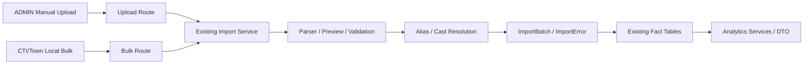
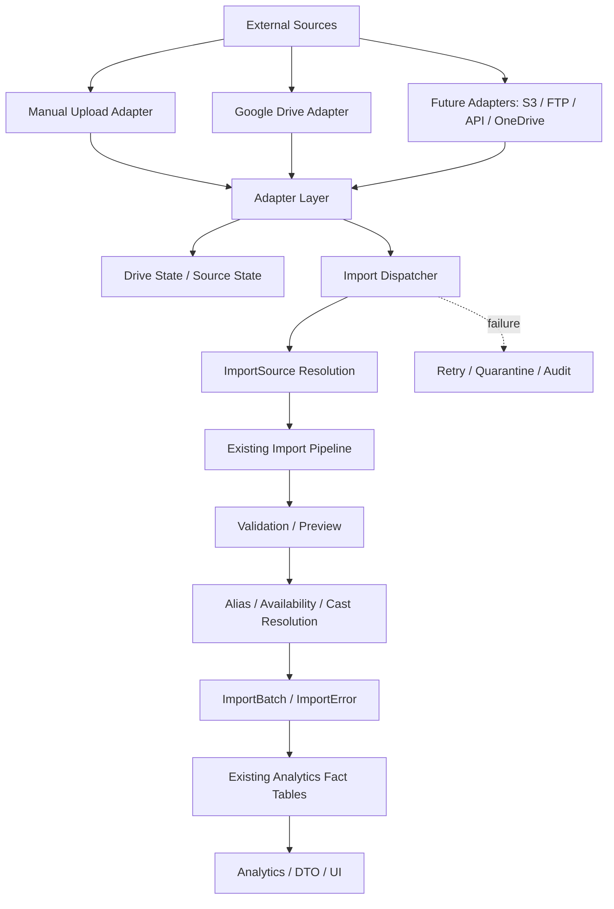
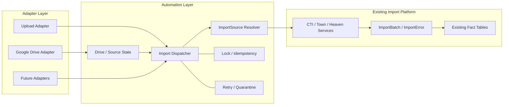
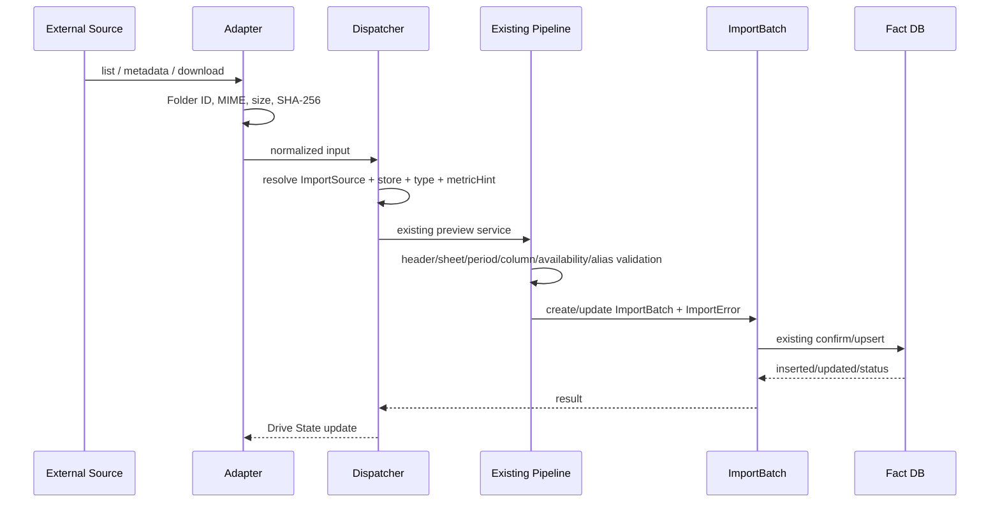

# Phase H Import Automation Architecture

## 1. Document Information

- 対象版: `v1.0.1-production-ready`
- 更新日: 2026-08-14
- 状態: **設計のみ（実装なし）**
- 参照:
  - `docs/PHASE_H_DRIVE_IMPORT_SOURCE_AUDIT.md`
  - `docs/PHASE_H_GOOGLE_DRIVE_FOLDER_SPEC.md`
  - `docs/HPLUS_ANALYTICS_COMPLETE_SYSTEM_SPECIFICATION_v1.0.1.md`

本書はGoogle Drive機能の実装仕様ではなく、将来のImport Automation Platform全体の境界・責務・状態遷移を定義する。今回の変更対象は本Markdownのみである。

## 2. Purpose

Manual Upload、Google Drive、将来のS3/FTP/API/OneDrive等を、既存のImport Pipelineへ安全に接続する。外部入力ごとに新しいParserやDB upsertを作るのではなく、入力取得と既存Import呼び出しを自動化層へ集約する。

## 3. Design Principles

1. Google DriveはImport機能ではなくInput Adapterである。
2. Adapterはファイルを取得・識別・一時保存するが、媒体固有の解析・保存を行わない。
3. **1 Folder = 1 Import Configuration**。Folder IDを媒体、店舗、`ImportDataType`、Heaven `metricHint`の正とする。
4. Folderが正しくても、既存ParserのMIME、拡張子、ヘッダー、シート、必須列、期間、外部店舗ID、Alias解決を通す。
5. ImportDispatcherはImportSourceを解決するだけで、Import処理を実装しない。
6. `ImportSource`は媒体仕様、Drive StateはDriveファイルの運用状態として責務を分離する。
7. ImportBatch/ImportErrorを既存の監査証跡として再利用する。
8. MISSING/UNAVAILABLEを0へ補完しない。未紐付け・曖昧・期間不一致は自動確定しない。
9. 原本は外部Sourceに残し、成功後にArchive/Errorへ自動移動しない。
10. 因果やデータ品質を自動推測しない。安全に判定できない場合は停止して監査可能にする。

## 4. Scope

### 対象

- 現行Manual Upload
- Phase H Google Drive Adapter
- `CTI_CAST_REPORT`
- `TOWN_STORE` / `TOWN_CAST` / `TOWN_URL` / `TOWN_LANDING`
- `HEAVEN_STORE` / `HEAVEN_CAST`とmetricHint
- 検知、重複、retry、quarantine、audit、状態管理の設計

### 対象外

- 今回のGoogle Drive API実装
- 新しいParser、Validation、Alias解決、Analytics Engine
- Prisma schema/migration
- S3/FTP/API/OneDriveの実装
- Archive/Errorへの自動ファイル移動
- 自動rollback、DB reset、seed

## 5. Current Architecture

現在はManual UploadとCTI/TownのローカルBulkが入口で、各既存Serviceがpreview、ImportBatch、ImportError、Alias/Cast解決、confirm/upsertを行う。



既存の主な保存先は`CtiCastDaily`、`TownStoreDaily`、`TownCastDaily`、`TownUrlDaily`、`TownLandingDaily`、`HeavenShopDaily`、`HeavenCastDaily`である。Google Drive導入後もこの流れを変えない。

## 6. Target Architecture



Adapter Layerの出力は、少なくとも`sourceType`、外部file ID、表示名、Folder ID、取得metadata、一時ファイル参照、SHA-256、対象Import設定候補で構成する。Parserの入力形式を変えないため、最終的には既存Uploadと同じ`File`/buffer相当として既存Serviceへ渡す。

### Component Diagram



この境界では、Adapter/Automationが`CtiCastDaily`等へ直接書き込まない。既存サービスを経由しない実装はArchitecture違反とする。

## 7. Adapter Layer

### 7.1 共通責務

- 外部Sourceから未処理ファイルを列挙する
- source固有IDとmetadataを取得する
- 安全な一時領域へdownloadする
- MIME、サイズ、拡張子を一次確認する
- SHA-256を計算する
- Dispatcherが扱える正規化Inputを返す
- API認証、quota、pagination、network retryを閉じ込める

### 7.2 Google Drive Adapter

Google Drive専用コードはAdapter境界だけに置く。

1. 登録済みFolder IDのみを監視する。
2. Folder名変更は設定へ影響させない。
3. Folder IDからImport Configurationを取得する。
4. `fileId`、`name`、`mimeType`、`size`、`modifiedTime`、revision相当metadataを取得する。
5. binaryを一時保存し、SHA-256を計算する。
6. InputをDispatcherへ渡す。

Drive Adapterは、Heaven `tokeiGirl_YYYYMM.csv`を内容からAccess等へ推測分類しない。Girl Access/Diary等のFolder設定にある`metricHint`を付与し、後段で再照合する。

### 7.3 Future Adapter

S3、FTP、API、OneDrive、Dropbox等は、同じ共通Adapter契約（list/download/metadata/hash）を実装するだけで追加できる構造とする。Source固有の再解析やfact upsertを各Adapterへ複製しない。

## 8. Import Dispatcher

Dispatcherの責務は、Adapter出力を既存Import呼び出しへルーティングすることだけである。

- Source種別と登録設定の存在確認
- Folder/file設定と`ImportSource`の整合確認
- `MediaType`、`Store`、`ImportDataType`、metricHintの解決
- 入力を既存Serviceへ渡す
- ImportBatch IDとDrive State IDの関連付け
- 同時実行制御の取得・解放

DispatcherはCSV/XLSXを解析しない。`createCtiPreview`、`createTownPreview`、`createHeavenPreview`等の既存Serviceを直接または既存Routeと同じApplication Service境界で呼び出す。

## 9. ImportSource Resolution

Folder Configurationから次を解決する。

| 項目 | 例 | 正の根拠 |
|---|---|---|
| `mediaType` | `CTI`/`TOWN`/`HEAVEN` | Folder設定 |
| `storeId/storeCode` | `KASUKABE`/`KOSHIGAYA` | Folder設定 |
| `importDataType` | `CTI_CAST_REPORT`, `TOWN_CAST`, `HEAVEN_CAST` | Folder設定 |
| `metricHint` | `PAGE_ACCESS`, `MY_GIRL` | Heaven metric Folder設定 |
| `importSourceId` | 既存DB ID | 設定とDBの対応 |
| `priority/status` | REQUIRED/OPTIONAL/FUTURE | Automation設定 |

現行の正式値は`MediaType`、`ImportDataType`、`HeavenMetricType`に限定する。未登録Folder、FUTURE設定、Kasukabe以外のHeavenは自動Importしない。

## 10. Existing Import Pipeline

既存処理を変更せず再利用する。

| Source | 既存入口 | 主要保存先 |
|---|---|---|
| CTI | `createCtiPreview` → `confirmCtiImport` | `CtiCastDaily` |
| Town | `createTownPreview` → `confirmTownImport` | `Town*Daily` |
| Heaven | `createHeavenPreview` → confirm処理 | `HeavenShopDaily` / `HeavenCastDaily` |

既存Pipelineが行う範囲には、parser、期間検証、必須列、value status、Preview JSON、ImportError、Cast/Alias解決、Availability、自然キーupsert、ImportBatch状態更新が含まれる。Automation Layerはこれらの判定を再実装しない。

## 11. Scheduler

SchedulerはFuture設計とする。候補を比較し、初期方針を別途決定する。

| 方式 | 長所 | 注意点 |
|---|---|---|
| cron | VPSで単純、導入容易 | 実行重複、停止、ログ、分散制御を別途必要 |
| long-running worker | retry/queueを自然に実装 | process監視、再起動、memory管理が必要 |
| queue/worker | backoff、並列制御、再実行が明確 | Redis等の追加運用が必要 |
| Drive push/watch | 遅延が小さい | token更新、期限、再同期、quota設計が必要 |

初期は5〜10分間隔のpollingまたはworkerを想定するが、実装前に運用方式を確定する。1回のtickが重複起動してもLockで安全に停止できることを必須とする。

## 12. Lock and Concurrency

同一file、同一設定、同一対象期間の重複処理を防ぐ。

- `driveFileId`単位の短期処理Lock
- `folderId + importDataType + targetPeriod`単位の業務Lock
- 既存SHA/idempotency確認前後のraceを防ぐDB advisory lockまたは同等機構
- Lock取得失敗は「処理中」として再試行可能にし、二重Importを成功扱いにしない
- Lock TTL、owner、取得時刻、解放時刻、異常終了時の回収を監査する

LockはDB resetや既存ImportBatch削除を行わない。

## 13. Retry

失敗を一括で無限再実行しない。

### Retry可能

- Google API timeout、5xx、quota、一時的network error
- download途中の一時I/O error
- worker再起動による未完了状態

### Retry不可（即Quarantine/Manual Review）

- 未登録Folder ID
- MIME/拡張子不一致
- Header/Sheet/必須列不足
- 期間不一致
- Heaven metricHint不一致
- Cast/Alias曖昧、外部店舗ID不一致
- 同日別SHAの修正版候補

指数backoff、最大試行回数、jitter、dead-letter相当状態は実装時に決定する。再試行回数はDrive Stateへ、Importのvalidation errorはImportErrorへ記録する。

## 14. Quarantine

Quarantineは「元ファイルを別Folderへ移動すること」と同義にしない。

- Drive原本は元Folderに保持
- Automation側で`QUARANTINED`/`MANUAL_REVIEW`状態を記録
- ImportBatchを作成できる段階ならそのIDを関連付ける
- Parser到達前はDrive Stateのerrorとして記録する
- Parser到達後の行/列/解決エラーは既存ImportErrorを正とする
- `Error` Folderへの自動移動はPhase H v1では行わない

## 15. Drive State

### 15.1 責務

Drive StateはGoogle Drive上のファイル検知・取得・再処理状態を管理する。媒体仕様や分析値の定義は持たず、ImportSourceの代替でもない。

### 15.2 候補モデル（設計のみ）

```text
DriveFileState
  id
  driveFileId
  folderId
  displayName
  mediaType
  storeId / storeCode
  importDataType
  metricHint
  mimeType
  size
  sha256
  modifiedTime
  firstDetectedAt
  lastDownloadedAt
  lastImportedAt
  importBatchId
  status
  errorMessage
  retryCount
  createdAt
  updatedAt
```

候補statusは`DETECTED`、`DOWNLOADING`、`DOWNLOADED`、`DISPATCHED`、`PREVIEW_READY`、`IMPORTED`、`DUPLICATE`、`RETRY_WAITING`、`QUARANTINED`、`IGNORED`とするが、正式enumは実装時に確定する。

### 15.3 ImportSourceとの差

| | ImportSource | DriveFileState |
|---|---|---|
| 対象 | 媒体・種別・店舗の仕様設定 | 個別Driveファイルの状態 |
| 例 | `TOWN_CAST`/越谷 | fileId、modifiedTime、SHA、retry |
| ライフサイクル | 設定が有効/無効 | 検知→取得→Import→重複/失敗 |
| 既存DB | 既に存在 | 今回は追加しない |
| 役割 | Dispatcherの解決先 | Adapterの監査・idempotency |

現行`ImportSource.folderPath`は将来用の文字列であり、Drive State全体を表現しない。DB追加は別承認とする。

## 16. Duplicate Policy

各識別子の役割を分ける。

- **Drive File ID**: 外部ファイル実体の同一性。変更追跡の主キー候補。
- **modifiedTime**: 同じfileIdの更新検知。時計だけを正とせずSHAと併用する。
- **SHA-256**: 実バイト列の内容同一性。別fileIdの同一ファイルも検出する。
- **ImportBatch**: 既存PipelineのImport実行証跡、対象期間、状態、件数、保存先との関連。

未変更fileIdは再Importしない。同一SHAは既存の完了済み重複ポリシーを尊重する。同一期間・別SHAはCTI/Town/Heavenの修正版候補として自動上書きしない。

## 17. File Lifecycle

```text
Drive原本（元Folder保持）
  ↓ list / metadata
Folder ID → Import Configuration解決
  ↓ download
一時ファイル
  ↓ MIME / size / SHA-256
Adapter正規化Input
  ↓ Dispatcher
既存Preview / Validation / Alias解決
  ↓ confirm条件を満たす場合
既存ImportBatch → fact table upsert
  ↓
Drive State + ImportBatch + ImportError監査
  ↓
一時ファイル削除
```

一時ファイル削除に失敗しても、Import成功と混同しない。原本はDriveから削除・移動しない。

## 18. Folder Policy

正式構成は`docs/PHASE_H_GOOGLE_DRIVE_FOLDER_SPEC.md`を正とする。

- CTI: `CTI`（直下XLSX、3店舗シート）
- Town: 春日部/越谷の店舗別・女子別・URL別・LP別
- Heaven: 春日部のShopと7つのGirl metric Folder
- Archive/Error: v1未使用のFuture

Folder IDが唯一の正で、Folder名変更は設定を変えない。Heaven Girlの同名`tokeiGirl_YYYYMM.csv`はFolderの`metricHint`で区別する。

## 19. Validation Boundary



Adapterで成功してもImport成功ではない。既存Pipelineの`PREVIEW_READY`、`WAITING_FOR_CAST_LINK`、`COMPLETED`、`COMPLETED_WITH_WARNINGS`等をそのまま監査する。

## 20. Failure and Audit Relationship

| Failure stage | 主状態 | 記録先 | 次の扱い |
|---|---|---|---|
| 未登録Folder | UNMAPPED | Drive State/監査 | 自動Importしない |
| API/download | RETRY_WAITINGまたはQUARANTINED | Drive State | backoff後再試行/手動確認 |
| MIME/サイズ/SHA | QUARANTINED | Drive State | Parserへ渡さない |
| Header/Sheet/期間/必須列 | FAILED | ImportBatch + ImportError | 既存Import詳細で確認 |
| Cast/Alias曖昧 | WAITING_FOR_CAST_LINK | ImportBatch + ImportError | 管理者解決後に再処理 |
| 重複SHA | DUPLICATE | Drive State + ImportBatch | 既存Batchを正とする |
| DB upsert | FAILED | ImportBatch + app log | 自動rollbackしない。手動判断 |

## 21. Scheduler and Production

本番では既存`deploy-production.sh`、backup/restore/retention運用と独立した10分間隔のone-shot pollを運用する。Phase H v1のProduction pollはscan、detection、download、SHA-256、DriveFileState更新、RESOLVE_ONLYまでで終了し、Import Pipeline、AUTO confirm、ImportBatch自動作成は行わない。`docker compose down`、DB reset、seed、既存driver-management操作は行わない。

Scheduler/Workerには、health、処理件数、待機件数、retry件数、quarantine件数、処理時間、最終成功時刻、Drive API quotaを外部監視へ渡せる設計余地を持たせる。ただし外部監視/SLO/通知はFutureである。

## 22. Implementation Plan

| Phase | 内容 | 成果物 | 今回 |
|---|---|---|---|
| H1 | Architecture | 本書、境界、状態、失敗方針 | **COMPLETE** |
| H2 | Google Authentication | Service Account、secret、権限 | **COMPLETE** |
| H3 | Drive Adapter | Folder polling、metadata、download、hash | **COMPLETE** |
| H4 | Dispatcher | Folder ID→ImportSource、既存Service呼出し | **COMPLETE**（RESOLVE_ONLY） |
| H5 | Drive State | fileId/status/idempotency永続化 | **COMPLETE** |
| H6 | Scheduler | cron、advisory lock、polling | **COMPLETE** |
| H7 | Retry | backoff、manual retry境界 | **COMPLETE** |
| H8 | Monitoring | poll log、retry/lock observability基盤 | **COMPLETE** |
| H9 | Production | credential mount、MVP mapping、10分poll、runbook | **COMPLETE**（Import未解放） |

各Phaseで既存Import Pipelineの回帰テスト、dry-run、preview-onlyを先に行い、いきなり自動確定しない。

## 23. Open Questions

- Google Workspaceの共有Drive/Service Account/OAuth方式と最小権限は何か。
- 実Folder IDをどのProduction Secret/Configurationへ登録するか。
- Drive Stateを既存ImportSourceへ拡張するか、新モデルにするか。
- Polling、Drive watch、cron、worker、queueの初期方式と実行間隔（5〜10分）をどうするか。
- REQUIREDのみで開始するか、OPTIONALを初期監視するか。
- Heaven通知系の実ファイル定義、metricHint、snapshotリセット規則を確定できるか。
- Auto-confirmを許可するImport種別と、ADMIN confirm必須の範囲はどこか。
- 同日別SHA修正版、partial import、未紐付けAliasの自動再処理方針は何か。
- retry上限、quarantine解除、通知先、SLO、Drive API quotaの運用値は何か。
- 原本の保持期間、Drive側の版管理、退職者・権限変更時の監査はどうするか。

## 24. Appendix: Formal Values

- `MediaType`: `CTI`, `TOWN`, `HEAVEN`
- `ImportDataType`: `CTI_CAST_REPORT`, `TOWN_STORE`, `TOWN_CAST`, `TOWN_URL`, `TOWN_LANDING`, `HEAVEN_STORE`, `HEAVEN_CAST`
- Heaven `metricHint`: `PAGE_ACCESS`, `DIARY_POSTS`, `MY_GIRL`, `MITENE_SENT`, `OKINI_TALK_SENT`, `ATTENDANCE_NOTICE`, `DIARY_NOTICE`
- `ImportSourceKind`: `MANUAL_UPLOAD`, `GOOGLE_DRIVE`

この設計書は上記の既存正式値を参照する。新しいImportDataType、metric enum、Parser、fact tableを追加する仕様ではない。
